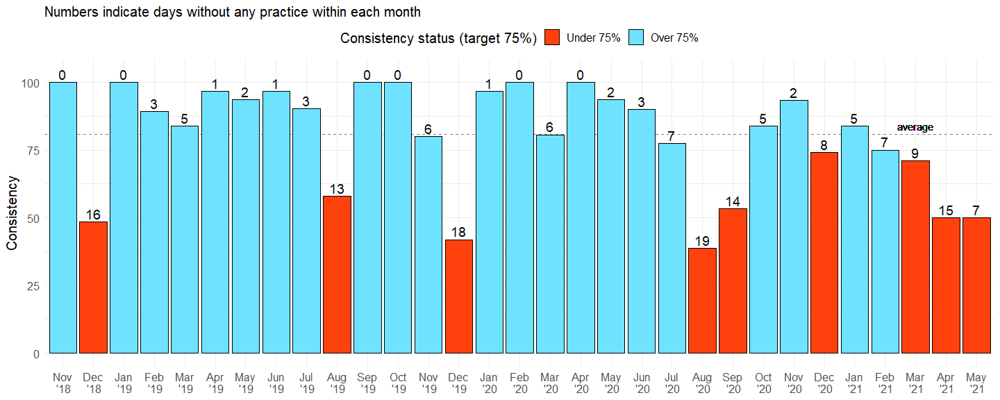
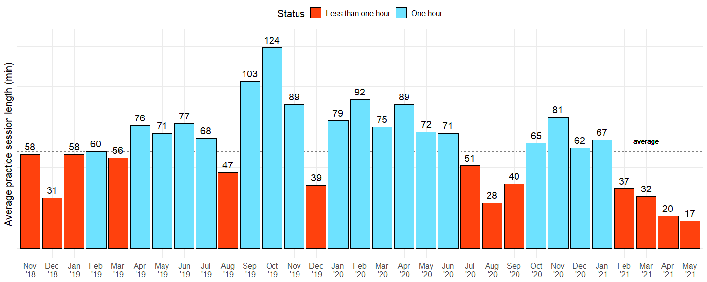

---
    output:
      html_document:
              
        toc: true
        toc_float: false
        toc_depth: 3
        number_sections: true
        
        code_folding: hide
        code_download: true
        
        fig_width: 9 
        fig_height: 5
        fig_align: "center"
        
        highlight: pygments
        theme: cerulean
        
        keep_md: true
        
    title: "Human Learning meets Machine Learning"
    subtitle: "1,200+ hours of piano practice"
    author: "by Peter Hontaru"
---

# Introduction

## What am I hoping to achieve with this project?

* predict how long it will take to learn a piece based on various features
* discover insights into my practice habits and find areas where I need to improve
* develop a recommender tool of piano pieces for others to select from based on factors of interest
* hopefully act as a source of inspiration/realistic piano progress for others who want to learn a musical instrument

**Context**: I started playing the piano in 2018 as a complete beginner and I've been tracking my practice time for around 2 and a half years. I now decided to put that to good use and see what interesting patterns I might be able to find.

## Data collection

* imputed conservative estimations for the first 10 months of the first year (Jan '18 to Oct '18)
* everything from Dec '18 onwards was tracked using Toggl, a time-tracking app/tool
* these times include my practice sessions (usually in short bouts of 30 minutes); piano lessons are excluded (usually 2-3 hours total per month)
* the **Extract, Transform, Load** script is available in the global.R file of this repo

**Disclaimer**: I am not affiliated with Toggl. I started using it a few years ago because it provided all the functionality I needed and loved its minimalistic design. The standard membership, which I use, is free of charge.

# Key insights

## Summary:

* identified various trends in average daily practice session, time of year, etc
* pieces could take me anywhere from around 4 hours to 40+ hours, subject to difficulty (as assessed by the ABRSM grade)
* the Random Forrest model was shown to be the most optimal model
  - **Rsquared** (0.585)
  - **MAE** - 5.9 hours 
  - **RMSE** - 7.5 hours
  * Looking at the variability of errors, there is still a tendency to over-predict for pieces that took very little and under-predict for the more difficult ones. There could be two main reasons for this:
    * practicing an old piece in order to further improve (which naturally adds more practice time as I re-learn it)
    * learning easier pieces later on in my journey which means I will learn them faster than expected (based on my earlier data where a piece of a similar difficulty took longer)
* the most important variables were shown to be the number of **length of the piece**, **standard of playing** (performance vs casual) and **experience**(cumulative hours before first practice session on each piece)


```r
knitr::opts_chunk$set(
    echo = TRUE, # show all code
    tidy = FALSE, # cleaner code printing
    size = "small", # smaller code
    
    fig.path = "figures/", #graphics location
    out.width = "100%",

    message = FALSE,
    warning = FALSE
    )
```


# Exploratory Data Analysis (EDA)

## Piano practice timeline


```r
raw_data%>%
  group_by(Month_format)%>%
  summarise(Total_Duration = sum(Duration)/60)%>%
  mutate(Total_Duration2 = as.integer(cumsum(Total_Duration)),
         max = as.integer(max(Total_Duration2)),
         max = ifelse(max > Total_Duration2, "", max))%>%

  ggplot(aes(Month_format, Total_Duration2, group = 1))+
  geom_line(size = 2, color = "#69b3a2")+
  geom_point(size = 5, color = "#69b3a2")+
  geom_area(alpha = 0.3, fill = "#69b3a2")+
  # grade 3
  geom_point(x="Oct\n '18", y = 253, size = 5, color = "dark red")+
  geom_text(x="Oct\n '18", y = 253+200, size = 5, label = "Grade 3")+
  geom_text(x="Oct\n '18", y = 253+100,  size = 5, label = "253 hours")+
  # grade 5
  geom_point(x="Oct\n '19", y = 675, size = 5, color = "dark red")+
  geom_text(x="Oct\n '19", y = 675+200,  size = 5, label = "Grade 5")+
  geom_text(x="Oct\n '19", y = 675+100,  size = 5, label = "675 hours")+
  # grade 6
  geom_point(x="Oct\n '20", y = 1078, size = 5, color = "dark red")+
  geom_text(x="Oct\n '20", y = 1078+200,  size = 5, label = "Grade 6")+
  geom_text(x="Oct\n '20", y = 1078+100,  size = 5, label = "1078 hours")+
  # NOW
  geom_point(aes(x="Apr\n '21", y = 1219), size = 5, color = "dark red")+
  geom_text(aes(label = max), nudge_y = 75, nudge_x = -0.5, size = 5)+
  scale_fill_gradient(low="yellow", high="red")+
  labs(x = NULL,
       y = "Total hours of practice",
       title = "Piano practice timeline")+
  theme_ipsum_es()+
  theme(legend.position = "top")
```


## How long did I practice per piece?

Based on the level at the time and the difficulty of the piece, we can see that each piece took around 10-30 hours of practice.


```r
raw_data%>%
  filter(Date_Start > as.Date("2018/11/01"))%>%
  filter(Completed == "Yes")%>%
  group_by(Project, Date_Start)%>%
  summarise(Duration = sum(Duration)/60)%>%
  mutate(Cumulative_Piece = cumsum(Duration),
         Month_Year = as.factor(as.yearmon(Date_Start)),
         Month_format = str_replace(Month_Year, " 20", "\n '"))%>%
  ungroup()%>%
  mutate(Cumulative_Total = cumsum(Duration))%>%
  filter(Project %notin% c("Technique", "General", "Sightreading"))%>%
  left_join(model_data%>%select(Level, Project, ABRSM), by = "Project")%>%
  
ggplot(aes(Date_Start, Cumulative_Piece, fill = Level)) +
  geom_point(size = 10, shape = 21, col = "black", alpha = 0.5) +
  scale_size(range = c(.1, 16), guide = FALSE) +
  labs(title = 'Year: {frame_time}',
       y = "Total practice time per piece (hours)")+
  scale_color_tron()+
  scale_fill_tron()+
  theme_ipsum_es() +
  theme(legend.position = "top")+
  transition_time(Date_Start) +
  ease_aes('linear')+
  exit_fade() +
  shadow_mark(alpha = 0.1, size = 5)
```


```r
# save animation as gif for later use
# anim_save("figs/timeline.gif")
```

## How consistent was my practice?

Generally, I've done pretty well to maintain a high level of consistency with the exception of August/December. This is usually where I tend to take annual leave.


```r
raw_data%>%
  filter(Source != "Estimated")%>%
  group_by(Month_Year, Month_Start, Month_format)%>%
  summarise(Days_Practice = n_distinct(Date_Start),
            Total_Duration = sum(Duration, na.rm = TRUE))%>%
  mutate(Days_Total = days_in_month(Month_Start),
         Days_Not_Practiced = Days_Total - Days_Practice,
         Avg_Duration = as.integer(Total_Duration/Days_Total),
         Consistency = round(Days_Practice / Days_Total * 100,2),
         Consistency_Status = ifelse(Consistency<75, "Bad", "Good"),
         Month_format = reorder(Month_format, Month_Year))%>%
  
  ggplot(aes(Month_format, Consistency, fill = Consistency_Status))+
  geom_col(group = 1, col = "black")+
  geom_hline(yintercept = 75, lty = "dashed")+
  geom_text(aes(label = Days_Not_Practiced), size = 5, nudge_y = 3)+
  labs(x = NULL,
       fill = "Consistency status",
       subtitle = "Numbers indicate days without any practice within each month")+
  scale_color_tron()+
  scale_fill_tron()+
  theme_ipsum_es()+
  theme(legend.position = "top")
```



## Was there a trend in my amount of daily average practice? {.tabset .tabset-fade .tabset-pills}

We can see that my practice time was correlated with the consistency, where the average session was much shorter in the months I was away from the piano. There's also a trend where my practice close to an exam session was significantly higher than any other time of the year. **Can you spot in which month I had my exam in 2019? What about the end of 2020?**

*average practice length per month includes the days in which I did not practice*

### overall {-}


```r
raw_data%>%
  filter(Source != "Estimated")%>%
  group_by(Month_Year, Month_Start, Month_format)%>%
  summarise(Days_Practice = n_distinct(Date_Start),
            Total_Duration = sum(Duration))%>%
  mutate(Days_Total = days_in_month(Month_Start),
         Avg_Duration = as.integer(Total_Duration/Days_Total),
         Avg_Duration_Status = ifelse(Avg_Duration < 60, "Less than one hour", "One hour"),
         Month_format = reorder(Month_format, Month_Year))%>%
  
  ggplot(aes(Month_format, Avg_Duration, fill = Avg_Duration_Status))+
  geom_col(col = "black")+
  labs(x = NULL,
       y = "Average practice session length (min)",
       fill = "Status")+
  geom_text(aes(label = Avg_Duration), nudge_y = 5, size = 5)+
  scale_color_tron()+
  scale_fill_tron()+
  theme_ipsum_es()+
  theme(legend.position = "top",
        axis.text.y = element_blank(),
        axis.ticks.y = element_blank())
```



### Year on Year {-}

Similar trends as before are apparent where my average daily session is longer before the exams than any other time in the year and a dip in the months where I usually take most of my annual leave. I really do need to start picking up the pace and get back to where I used to be.


```r
raw_data%>%
  group_by(Month_Year, Month_Start, Month_format, Month_Name, Year)%>%
  summarise(Days_Practice = n_distinct(Date_Start),
            Total_Duration = sum(Duration))%>%
  mutate(Days_Total = days_in_month(Month_Start),
         Avg_Duration = as.integer(Total_Duration/Days_Total),
         Avg_Duration_Status = ifelse(Avg_Duration < 60, "Less than one hour", "One hour"),
         Month_format = reorder(Month_format, Month_Year),
         size = as.factor(ifelse(Year == 2018, 1, 1.5)),
         label = ifelse(month(Month_Start) == 1, as.character(Year), ""))%>%
  
  ggplot(aes(Month_Name, Avg_Duration, group = Year, size = size))+
  geom_line(aes(col = Year))+
  geom_label_repel(aes(label = label, col = Year))+
  labs(x = NULL,
       fill = "Status")+
  scale_color_tron()+
  scale_fill_tron()+
  theme_ipsum_es()+
  theme(legend.position = "none")
```


## Did COVID significantly impact my practice time? {.tabset .tabset-fade .tabset-pills}

### graph {-}

Despite a similar median, we can see that the practice sessions were less likely to be over 80 min after COVID. We can test if this was a significant impact with a t-test.


```r
covid_start <- as.Date("2020/03/23")

inference <- raw_data%>%
  filter(Source != "Estimated")%>%
  mutate(Covid_Status = as.factor(ifelse(Date_Start < covid_start, "Before COVID", "After COVID")),
         Covid_Status = reorder(Covid_Status, desc(Covid_Status)))%>%
  group_by(Covid_Status, Date_Start)%>%
  summarise(Duration = sum(Duration))%>%
  ungroup()
  
  ggplot(inference, aes(Covid_Status, Duration, fill = Covid_Status))+
  geom_boxplot(varwidth = TRUE, col = "black")+
  labs(x = NULL,
       y = "Average practice session (min)")+
  scale_color_tron()+
  scale_fill_tron()+
  theme_ipsum_es()+
  theme(legend.position = "none")
```


### skewness assumption {-}

Given the extremely low p-value, the Shapiro-Wilk normality test implies that the distribution of the data is significantly different from a normal distribution and that we cannot assume the normality. However, we're working with the entire population dataset for each class and thus, unlike the independence of data, this assumption is not crucial.
  

```r
  inference %>% 
  select(Covid_Status, Duration) %>% 
  group_by(group = as.character(Covid_Status)) %>%
  do(tidy(shapiro.test(.$Duration)))%>%
  kbl(caption = "Shapiro-Wilk normality test")%>%
  kable_paper("hover", full_width = F)
```

<table class=" lightable-paper lightable-hover" style='font-family: "Arial Narrow", arial, helvetica, sans-serif; width: auto !important; margin-left: auto; margin-right: auto;'>
<caption>Shapiro-Wilk normality test</caption>
 <thead>
  <tr>
   <th style="text-align:left;"> group </th>
   <th style="text-align:right;"> statistic </th>
   <th style="text-align:right;"> p.value </th>
   <th style="text-align:left;"> method </th>
  </tr>
 </thead>
<tbody>
  <tr>
   <td style="text-align:left;"> After COVID </td>
   <td style="text-align:right;"> 0.9607325 </td>
   <td style="text-align:right;"> 3e-07 </td>
   <td style="text-align:left;"> Shapiro-Wilk normality test </td>
  </tr>
  <tr>
   <td style="text-align:left;"> Before COVID </td>
   <td style="text-align:right;"> 0.9549818 </td>
   <td style="text-align:right;"> 0e+00 </td>
   <td style="text-align:left;"> Shapiro-Wilk normality test </td>
  </tr>
</tbody>
</table>

### equal variances assumption {-}

We can see that with a large p value, we should fail to reject the Null hypothesis (Ho) and conclude that we do not have evidence to believe that population variances are not equal and use the equal variances assumption for our t test


```r
tidy(leveneTest(inference$Duration~inference$Covid_Status))%>%
  kbl(caption = "Levene's test")%>%
  kable_paper("hover", full_width = F)
```

<table class=" lightable-paper lightable-hover" style='font-family: "Arial Narrow", arial, helvetica, sans-serif; width: auto !important; margin-left: auto; margin-right: auto;'>
<caption>Levene's test</caption>
 <thead>
  <tr>
   <th style="text-align:right;"> statistic </th>
   <th style="text-align:right;"> p.value </th>
   <th style="text-align:right;"> df </th>
   <th style="text-align:right;"> df.residual </th>
  </tr>
 </thead>
<tbody>
  <tr>
   <td style="text-align:right;"> 0.0410026 </td>
   <td style="text-align:right;"> 0.8395891 </td>
   <td style="text-align:right;"> 1 </td>
   <td style="text-align:right;"> 732 </td>
  </tr>
</tbody>
</table>

### t-test {-}

My practice sessions post-COVID are significantly shorter than those before the pandemic. This might be surprising, given that we were in the lockdown most of the time. However, I've been spending my time doing a few other things such as improving my technical skillset with R (this analysis wouldn't have been possible otherwise) and learning italian.


```r
t_test <- inference%>%
  t_test(Duration ~ Covid_Status, var.equal = TRUE)%>%
  add_significance()%>%
  kbl()%>%
  kable_paper("hover", full_width = F)

t_test
```

<table class=" lightable-paper lightable-hover" style='font-family: "Arial Narrow", arial, helvetica, sans-serif; width: auto !important; margin-left: auto; margin-right: auto;'>
 <thead>
  <tr>
   <th style="text-align:left;"> .y. </th>
   <th style="text-align:left;"> group1 </th>
   <th style="text-align:left;"> group2 </th>
   <th style="text-align:right;"> n1 </th>
   <th style="text-align:right;"> n2 </th>
   <th style="text-align:right;"> statistic </th>
   <th style="text-align:right;"> df </th>
   <th style="text-align:right;"> p </th>
   <th style="text-align:left;"> p.signif </th>
  </tr>
 </thead>
<tbody>
  <tr>
   <td style="text-align:left;"> Duration </td>
   <td style="text-align:left;"> Before COVID </td>
   <td style="text-align:left;"> After COVID </td>
   <td style="text-align:right;"> 433 </td>
   <td style="text-align:right;"> 301 </td>
   <td style="text-align:right;"> 3.319481 </td>
   <td style="text-align:right;"> 732 </td>
   <td style="text-align:right;"> 0.000947 </td>
   <td style="text-align:left;"> *** </td>
  </tr>
</tbody>
</table>

## What type of music do I tend to play? {.tabset .tabset-fade .tabset-pills}

### by genre {-}


```r
graph_practice <- function(variable, nudge){
  raw_data%>%
  filter(Genre %notin% c("Other", "Not applicable"))%>%
  group_by({{variable}})%>%
  summarise(Duration = as.integer(sum(Duration)/60))%>%
  arrange(desc(Duration))%>%
  head(10)%>%

  ggplot(aes(reorder({{variable}}, Duration), Duration, fill = Duration))+
  geom_col(show.legend = FALSE, col = "black", width = 1)+
  geom_text(aes(label = Duration), show.legend = FALSE, nudge_y = nudge, size = 5)+
  scale_fill_gradient(low="yellow", high="red")+
  labs(x = NULL,
       y = "Total hours of practice")+
  coord_flip()+
  theme_ipsum_es()+
  theme(axis.text.x = element_blank(),
        axis.ticks = element_blank())
}

graph_practice(Genre, 15)
```


### by composer {-}


```r
graph_practice(Composer, 5)
```


### by piece {-}


```r
graph_practice(Project, 3)
```


## Relation between difficulty and number of practice hours {.tabset .tabset-fade .tabset-pills}

### ABRSM grade {-}

Simplified, ABBRSM grades are a group of 8 exams based on their difficulty (1 - beginner to 8 - advanced). There are also diploma grades but those are extremely advanced, equivalent to university level studies and out of the scope of this analysis. 

More information can be found on their official website at https://gb.abrsm.org/en/exam-support/your-guide-to-abrsm-exams/


```r
model_data%>%
  mutate(Duration = Duration)%>%
  
  ggplot(aes(ABRSM, Duration, fill = ABRSM))+
  geom_boxplot(varwidth = TRUE, outlier.colour = "red")+
  labs(x = "ABRSM Grade",
       y = "Total practice hours",
       subtitle = "The higher the difficulty, the more time it takes to learn a piece")+
  scale_color_tron()+
  scale_fill_tron()+
  theme_ipsum_es()+
  theme(legend.position = "none")
```


### level {-}

A further aggregation of ABRSM grades; this is helpful given the very limited dataset within each grade and much easier on the eye. This is an oversimplification but they're classified as:
  * 1-5: Beginner (1)
  * 5-6: Intermediate (2)
  * 7-8: Advanced (3)


```r
model_data%>%
  mutate(Duration = Duration)%>%
  
  ggplot(aes(Level, Duration, fill = Level))+
  geom_boxplot(varwidth = TRUE, outlier.colour = "red")+
  scale_color_tron()+
  scale_fill_tron()+
  labs(x = "Level",
       y = "Total practice hours",
       subtitle = "The higher the difficulty, the more time it takes to learn a piece")+
  theme_ipsum_es()+
  theme(legend.position = "none")
```


## What about the piece length?


```r
model_data%>%
  
  ggplot(aes(Length, Duration, group = 1))+
  geom_jitter(aes(col = Level), width = 0.5, height = 0.5, size = 3)+
  geom_smooth(method = "lm", se=FALSE)+
  labs(x = "Piece length (mins)",
       y = "Hours needed to learn a piece",
       subtitle = "There appears to be a linear trend between piece length and total practice time")+
  scale_color_tron()+
  scale_fill_tron()+
  theme_ipsum_es()+
  theme(legend.position = "top")
```


## Learning effect - do pieces of the same difficulty become easier to learn with time?

We can spot a trend where the time required to learn a piece of a similar difficulty (ABRSM Grade) decreases as my ability to play the piano increases (as judged by cumulative hours of practice). We should keep this in mind and include it as a variable into our prediction model.


```r
model_data%>%
  
  ggplot(aes(Cumulative_Duration, Duration, group = 1))+
  geom_point(aes(col = Level), size = 3)+
  geom_smooth(method = "lm", se=FALSE)+
  labs(x = "Cumulative hours practiced before the first practice of each piece",
       y = "Hours needed to learn a piece",
       subtitle = "Pieces of a similar difficulty become faster to learn")+
  scale_color_tron()+
  scale_fill_tron()+
  theme_ipsum_es()+
  theme(legend.position = "top")
```


## Does "pausing" a piece impact the total time required to learn it?

How do we differentiate between pieces that we learn once and those that we come back to repeatedly? Examples could include wanting to improve the playing further, loving it so much we wanted to relearn it, preparing it for a new performance, etc.

As anyone that ever played the piano knows, re-learning a piece, particularly after you "drop" it for a few months/years, results in a much better performance/understanding of the piece. I definitely found that to be true in my experience, particularly with my exam pieces.The downside is that these pieces take longer to learn.


```r
model_data%>%
  mutate(Project_formatted = str_replace_all(Project,"[^[:graph:]]", " "),
         Project_label = as.factor(ifelse(Max_Break > 31, Project_formatted, "")))%>%
  
  ggplot(aes(as.integer(Max_Break), Duration, col = Max_Break <= 31))+
  geom_point(size = 3)+
  geom_text_repel(aes(label = Project_label), size = 3, show.legend = FALSE)+
  scale_x_log10()+
  scale_color_tron(labels = c(TRUE, FALSE))+
  guides(colour = guide_legend(reverse=TRUE))+
  labs(x = "Maximum days passed between two consecutive sessions on the same piece (log scale)",
       y = "Hours needed to learn a piece",
       col = "Break (over 1 month)",
       subtitle = "Taking a break before finishing a piece might lead to more hours required to learn it")+
  theme_ipsum_es()+
  theme(legend.position = "top")
```


## Repertoire


```r
model_data%>%
  select(-Days_Practiced, -Date_End, -Max_Break)%>%
  mutate(Duration = round(Duration),
         Length = round(Length, 1))%>%
  arrange(desc(Date_Start))%>%
  rename(Experience = Cumulative_Duration,
         Started = Date_Start)%>%
  relocate(Project, Duration, Genre, ABRSM, Level, Standard, Length, Experience, Break, Started)%>%
  
  kbl(escape = FALSE,caption = "Repertoire")%>%
  kable_paper(c("hover", "striped"), full_width = F)%>%
  column_spec(c(1,2), bold = T, color = "black")%>%
  scroll_box(height = "450px")
```

<div style="border: 1px solid #ddd; padding: 0px; overflow-y: scroll; height:450px; "><table class=" lightable-paper lightable-striped lightable-hover" style='font-family: "Arial Narrow", arial, helvetica, sans-serif; width: auto !important; margin-left: auto; margin-right: auto;'>
<caption>Repertoire</caption>
 <thead>
  <tr>
   <th style="text-align:left;position: sticky; top:0; background-color: #FFFFFF;"> Project </th>
   <th style="text-align:right;position: sticky; top:0; background-color: #FFFFFF;"> Duration </th>
   <th style="text-align:left;position: sticky; top:0; background-color: #FFFFFF;"> Genre </th>
   <th style="text-align:left;position: sticky; top:0; background-color: #FFFFFF;"> ABRSM </th>
   <th style="text-align:left;position: sticky; top:0; background-color: #FFFFFF;"> Level </th>
   <th style="text-align:left;position: sticky; top:0; background-color: #FFFFFF;"> Standard </th>
   <th style="text-align:right;position: sticky; top:0; background-color: #FFFFFF;"> Length </th>
   <th style="text-align:right;position: sticky; top:0; background-color: #FFFFFF;"> Experience </th>
   <th style="text-align:left;position: sticky; top:0; background-color: #FFFFFF;"> Break </th>
   <th style="text-align:left;position: sticky; top:0; background-color: #FFFFFF;"> Started </th>
  </tr>
 </thead>
<tbody>
  <tr>
   <td style="text-align:left;font-weight: bold;color: black !important;"> Elton John - Rocket man </td>
   <td style="text-align:right;font-weight: bold;color: black !important;"> 47 </td>
   <td style="text-align:left;"> Modern </td>
   <td style="text-align:left;"> 7 </td>
   <td style="text-align:left;"> Advanced </td>
   <td style="text-align:left;"> Performance </td>
   <td style="text-align:right;"> 4.0 </td>
   <td style="text-align:right;"> 1130 </td>
   <td style="text-align:left;"> No </td>
   <td style="text-align:left;"> 2020-12-08 </td>
  </tr>
  <tr>
   <td style="text-align:left;font-weight: bold;color: black !important;"> Schumann - Träumerei </td>
   <td style="text-align:right;font-weight: bold;color: black !important;"> 14 </td>
   <td style="text-align:left;"> Romantic </td>
   <td style="text-align:left;"> 7 </td>
   <td style="text-align:left;"> Advanced </td>
   <td style="text-align:left;"> Average </td>
   <td style="text-align:right;"> 3.0 </td>
   <td style="text-align:right;"> 1087 </td>
   <td style="text-align:left;"> No </td>
   <td style="text-align:left;"> 2020-11-09 </td>
  </tr>
  <tr>
   <td style="text-align:left;font-weight: bold;color: black !important;"> Mozart - Allegro (3rd movement) K282 </td>
   <td style="text-align:right;font-weight: bold;color: black !important;"> 28 </td>
   <td style="text-align:left;"> Classical </td>
   <td style="text-align:left;"> 6 </td>
   <td style="text-align:left;"> Intermediate </td>
   <td style="text-align:left;"> Average </td>
   <td style="text-align:right;"> 3.3 </td>
   <td style="text-align:right;"> 1081 </td>
   <td style="text-align:left;"> Yes </td>
   <td style="text-align:left;"> 2020-11-05 </td>
  </tr>
  <tr>
   <td style="text-align:left;font-weight: bold;color: black !important;"> Ibert - Sérénade sur l’eau </td>
   <td style="text-align:right;font-weight: bold;color: black !important;"> 10 </td>
   <td style="text-align:left;"> Modern </td>
   <td style="text-align:left;"> 6 </td>
   <td style="text-align:left;"> Intermediate </td>
   <td style="text-align:left;"> Performance </td>
   <td style="text-align:right;"> 1.7 </td>
   <td style="text-align:right;"> 1038 </td>
   <td style="text-align:left;"> No </td>
   <td style="text-align:left;"> 2020-09-24 </td>
  </tr>
  <tr>
   <td style="text-align:left;font-weight: bold;color: black !important;"> Kuhlau - Rondo Vivace </td>
   <td style="text-align:right;font-weight: bold;color: black !important;"> 24 </td>
   <td style="text-align:left;"> Classical </td>
   <td style="text-align:left;"> 6 </td>
   <td style="text-align:left;"> Intermediate </td>
   <td style="text-align:left;"> Average </td>
   <td style="text-align:right;"> 2.2 </td>
   <td style="text-align:right;"> 1014 </td>
   <td style="text-align:left;"> No </td>
   <td style="text-align:left;"> 2020-08-03 </td>
  </tr>
  <tr>
   <td style="text-align:left;font-weight: bold;color: black !important;"> C. Hartmann - The little ballerina </td>
   <td style="text-align:right;font-weight: bold;color: black !important;"> 21 </td>
   <td style="text-align:left;"> Romantic </td>
   <td style="text-align:left;"> 6 </td>
   <td style="text-align:left;"> Intermediate </td>
   <td style="text-align:left;"> Performance </td>
   <td style="text-align:right;"> 2.0 </td>
   <td style="text-align:right;"> 998 </td>
   <td style="text-align:left;"> No </td>
   <td style="text-align:left;"> 2020-07-14 </td>
  </tr>
  <tr>
   <td style="text-align:left;font-weight: bold;color: black !important;"> Schumann - Lalling Melody </td>
   <td style="text-align:right;font-weight: bold;color: black !important;"> 5 </td>
   <td style="text-align:left;"> Romantic </td>
   <td style="text-align:left;"> 1 </td>
   <td style="text-align:left;"> Beginner </td>
   <td style="text-align:left;"> Average </td>
   <td style="text-align:right;"> 1.3 </td>
   <td style="text-align:right;"> 981 </td>
   <td style="text-align:left;"> No </td>
   <td style="text-align:left;"> 2020-06-28 </td>
  </tr>
  <tr>
   <td style="text-align:left;font-weight: bold;color: black !important;"> Schumann - Melody </td>
   <td style="text-align:right;font-weight: bold;color: black !important;"> 4 </td>
   <td style="text-align:left;"> Romantic </td>
   <td style="text-align:left;"> 1 </td>
   <td style="text-align:left;"> Beginner </td>
   <td style="text-align:left;"> Average </td>
   <td style="text-align:right;"> 1.0 </td>
   <td style="text-align:right;"> 972 </td>
   <td style="text-align:left;"> No </td>
   <td style="text-align:left;"> 2020-06-20 </td>
  </tr>
  <tr>
   <td style="text-align:left;font-weight: bold;color: black !important;"> Clementi - Sonatina no 3 - Mov 2 </td>
   <td style="text-align:right;font-weight: bold;color: black !important;"> 3 </td>
   <td style="text-align:left;"> Classical </td>
   <td style="text-align:left;"> 1 </td>
   <td style="text-align:left;"> Beginner </td>
   <td style="text-align:left;"> Performance </td>
   <td style="text-align:right;"> 1.0 </td>
   <td style="text-align:right;"> 952 </td>
   <td style="text-align:left;"> No </td>
   <td style="text-align:left;"> 2020-06-04 </td>
  </tr>
  <tr>
   <td style="text-align:left;font-weight: bold;color: black !important;"> Clementi - Sonatina no 3 - Mov 3 </td>
   <td style="text-align:right;font-weight: bold;color: black !important;"> 20 </td>
   <td style="text-align:left;"> Classical </td>
   <td style="text-align:left;"> 4 </td>
   <td style="text-align:left;"> Beginner </td>
   <td style="text-align:left;"> Performance </td>
   <td style="text-align:right;"> 2.0 </td>
   <td style="text-align:right;"> 952 </td>
   <td style="text-align:left;"> No </td>
   <td style="text-align:left;"> 2020-06-04 </td>
  </tr>
  <tr>
   <td style="text-align:left;font-weight: bold;color: black !important;"> Chopin - Waltz in Fm </td>
   <td style="text-align:right;font-weight: bold;color: black !important;"> 27 </td>
   <td style="text-align:left;"> Romantic </td>
   <td style="text-align:left;"> 6 </td>
   <td style="text-align:left;"> Intermediate </td>
   <td style="text-align:left;"> Performance </td>
   <td style="text-align:right;"> 2.0 </td>
   <td style="text-align:right;"> 895 </td>
   <td style="text-align:left;"> Yes </td>
   <td style="text-align:left;"> 2020-04-18 </td>
  </tr>
  <tr>
   <td style="text-align:left;font-weight: bold;color: black !important;"> Clementi - Sonatina no 3 - Mov 1 </td>
   <td style="text-align:right;font-weight: bold;color: black !important;"> 30 </td>
   <td style="text-align:left;"> Classical </td>
   <td style="text-align:left;"> 4 </td>
   <td style="text-align:left;"> Beginner </td>
   <td style="text-align:left;"> Performance </td>
   <td style="text-align:right;"> 2.7 </td>
   <td style="text-align:right;"> 877 </td>
   <td style="text-align:left;"> No </td>
   <td style="text-align:left;"> 2020-04-07 </td>
  </tr>
  <tr>
   <td style="text-align:left;font-weight: bold;color: black !important;"> Schumann - Kinderszenen 1 </td>
   <td style="text-align:right;font-weight: bold;color: black !important;"> 10 </td>
   <td style="text-align:left;"> Romantic </td>
   <td style="text-align:left;"> 5 </td>
   <td style="text-align:left;"> Intermediate </td>
   <td style="text-align:left;"> Average </td>
   <td style="text-align:right;"> 2.0 </td>
   <td style="text-align:right;"> 855 </td>
   <td style="text-align:left;"> No </td>
   <td style="text-align:left;"> 2020-03-25 </td>
  </tr>
  <tr>
   <td style="text-align:left;font-weight: bold;color: black !important;"> Bach - Prelude in G from Cello Suite No 1 </td>
   <td style="text-align:right;font-weight: bold;color: black !important;"> 25 </td>
   <td style="text-align:left;"> Baroque </td>
   <td style="text-align:left;"> 5 </td>
   <td style="text-align:left;"> Intermediate </td>
   <td style="text-align:left;"> Average </td>
   <td style="text-align:right;"> 2.5 </td>
   <td style="text-align:right;"> 788 </td>
   <td style="text-align:left;"> No </td>
   <td style="text-align:left;"> 2020-02-04 </td>
  </tr>
  <tr>
   <td style="text-align:left;font-weight: bold;color: black !important;"> Georg Böhm - Minuet in G </td>
   <td style="text-align:right;font-weight: bold;color: black !important;"> 7 </td>
   <td style="text-align:left;"> Baroque </td>
   <td style="text-align:left;"> 1 </td>
   <td style="text-align:left;"> Beginner </td>
   <td style="text-align:left;"> Average </td>
   <td style="text-align:right;"> 1.0 </td>
   <td style="text-align:right;"> 780 </td>
   <td style="text-align:left;"> Yes </td>
   <td style="text-align:left;"> 2020-01-27 </td>
  </tr>
  <tr>
   <td style="text-align:left;font-weight: bold;color: black !important;"> Bach - Invention 4 in Dm </td>
   <td style="text-align:right;font-weight: bold;color: black !important;"> 21 </td>
   <td style="text-align:left;"> Baroque </td>
   <td style="text-align:left;"> 5 </td>
   <td style="text-align:left;"> Intermediate </td>
   <td style="text-align:left;"> Performance </td>
   <td style="text-align:right;"> 1.7 </td>
   <td style="text-align:right;"> 777 </td>
   <td style="text-align:left;"> No </td>
   <td style="text-align:left;"> 2020-01-25 </td>
  </tr>
  <tr>
   <td style="text-align:left;font-weight: bold;color: black !important;"> Chopin - Contredanse in Gb </td>
   <td style="text-align:right;font-weight: bold;color: black !important;"> 23 </td>
   <td style="text-align:left;"> Romantic </td>
   <td style="text-align:left;"> 6 </td>
   <td style="text-align:left;"> Intermediate </td>
   <td style="text-align:left;"> Performance </td>
   <td style="text-align:right;"> 2.2 </td>
   <td style="text-align:right;"> 762 </td>
   <td style="text-align:left;"> No </td>
   <td style="text-align:left;"> 2020-01-16 </td>
  </tr>
  <tr>
   <td style="text-align:left;font-weight: bold;color: black !important;"> Bach - Minuet in Gm - 115 </td>
   <td style="text-align:right;font-weight: bold;color: black !important;"> 7 </td>
   <td style="text-align:left;"> Baroque </td>
   <td style="text-align:left;"> 1 </td>
   <td style="text-align:left;"> Beginner </td>
   <td style="text-align:left;"> Average </td>
   <td style="text-align:right;"> 1.3 </td>
   <td style="text-align:right;"> 750 </td>
   <td style="text-align:left;"> No </td>
   <td style="text-align:left;"> 2020-01-07 </td>
  </tr>
  <tr>
   <td style="text-align:left;font-weight: bold;color: black !important;"> Bach - Minuet in G - 114 </td>
   <td style="text-align:right;font-weight: bold;color: black !important;"> 4 </td>
   <td style="text-align:left;"> Baroque </td>
   <td style="text-align:left;"> NA </td>
   <td style="text-align:left;"> Advanced </td>
   <td style="text-align:left;"> NA </td>
   <td style="text-align:right;"> NA </td>
   <td style="text-align:right;"> 726 </td>
   <td style="text-align:left;"> No </td>
   <td style="text-align:left;"> 2019-12-06 </td>
  </tr>
  <tr>
   <td style="text-align:left;font-weight: bold;color: black !important;"> Elton John - Your song (Arr Cornick) </td>
   <td style="text-align:right;font-weight: bold;color: black !important;"> 36 </td>
   <td style="text-align:left;"> Modern </td>
   <td style="text-align:left;"> 5 </td>
   <td style="text-align:left;"> Intermediate </td>
   <td style="text-align:left;"> Performance </td>
   <td style="text-align:right;"> 3.3 </td>
   <td style="text-align:right;"> 713 </td>
   <td style="text-align:left;"> No </td>
   <td style="text-align:left;"> 2019-11-21 </td>
  </tr>
  <tr>
   <td style="text-align:left;font-weight: bold;color: black !important;"> Poulenc - Valse Tyrolienne </td>
   <td style="text-align:right;font-weight: bold;color: black !important;"> 17 </td>
   <td style="text-align:left;"> Modern </td>
   <td style="text-align:left;"> 5 </td>
   <td style="text-align:left;"> Intermediate </td>
   <td style="text-align:left;"> Performance </td>
   <td style="text-align:right;"> 1.7 </td>
   <td style="text-align:right;"> 562 </td>
   <td style="text-align:left;"> No </td>
   <td style="text-align:left;"> 2019-09-02 </td>
  </tr>
  <tr>
   <td style="text-align:left;font-weight: bold;color: black !important;"> Bach - Prelude in Cm - 934 </td>
   <td style="text-align:right;font-weight: bold;color: black !important;"> 25 </td>
   <td style="text-align:left;"> Baroque </td>
   <td style="text-align:left;"> 5 </td>
   <td style="text-align:left;"> Intermediate </td>
   <td style="text-align:left;"> Performance </td>
   <td style="text-align:right;"> 2.4 </td>
   <td style="text-align:right;"> 536 </td>
   <td style="text-align:left;"> No </td>
   <td style="text-align:left;"> 2019-08-15 </td>
  </tr>
  <tr>
   <td style="text-align:left;font-weight: bold;color: black !important;"> Schumann - Volksliedchen </td>
   <td style="text-align:right;font-weight: bold;color: black !important;"> 10 </td>
   <td style="text-align:left;"> Romantic </td>
   <td style="text-align:left;"> 2 </td>
   <td style="text-align:left;"> Beginner </td>
   <td style="text-align:left;"> Average </td>
   <td style="text-align:right;"> 1.8 </td>
   <td style="text-align:right;"> 501 </td>
   <td style="text-align:left;"> No </td>
   <td style="text-align:left;"> 2019-07-01 </td>
  </tr>
  <tr>
   <td style="text-align:left;font-weight: bold;color: black !important;"> Haydn - Andante in A </td>
   <td style="text-align:right;font-weight: bold;color: black !important;"> 39 </td>
   <td style="text-align:left;"> Classical </td>
   <td style="text-align:left;"> 5 </td>
   <td style="text-align:left;"> Intermediate </td>
   <td style="text-align:left;"> Average </td>
   <td style="text-align:right;"> 2.8 </td>
   <td style="text-align:right;"> 468 </td>
   <td style="text-align:left;"> Yes </td>
   <td style="text-align:left;"> 2019-06-08 </td>
  </tr>
  <tr>
   <td style="text-align:left;font-weight: bold;color: black !important;"> Schumann - Remembrance </td>
   <td style="text-align:right;font-weight: bold;color: black !important;"> 34 </td>
   <td style="text-align:left;"> Romantic </td>
   <td style="text-align:left;"> 5 </td>
   <td style="text-align:left;"> Intermediate </td>
   <td style="text-align:left;"> Performance </td>
   <td style="text-align:right;"> 2.2 </td>
   <td style="text-align:right;"> 422 </td>
   <td style="text-align:left;"> Yes </td>
   <td style="text-align:left;"> 2019-04-28 </td>
  </tr>
  <tr>
   <td style="text-align:left;font-weight: bold;color: black !important;"> Bach - Minuet in G - 116 </td>
   <td style="text-align:right;font-weight: bold;color: black !important;"> 8 </td>
   <td style="text-align:left;"> Baroque </td>
   <td style="text-align:left;"> NA </td>
   <td style="text-align:left;"> Advanced </td>
   <td style="text-align:left;"> NA </td>
   <td style="text-align:right;"> NA </td>
   <td style="text-align:right;"> 361 </td>
   <td style="text-align:left;"> Yes </td>
   <td style="text-align:left;"> 2019-03-04 </td>
  </tr>
  <tr>
   <td style="text-align:left;font-weight: bold;color: black !important;"> Bach - Invention 1 in C </td>
   <td style="text-align:right;font-weight: bold;color: black !important;"> 27 </td>
   <td style="text-align:left;"> Baroque </td>
   <td style="text-align:left;"> 5 </td>
   <td style="text-align:left;"> Intermediate </td>
   <td style="text-align:left;"> Performance </td>
   <td style="text-align:right;"> 1.7 </td>
   <td style="text-align:right;"> 350 </td>
   <td style="text-align:left;"> Yes </td>
   <td style="text-align:left;"> 2019-02-22 </td>
  </tr>
  <tr>
   <td style="text-align:left;font-weight: bold;color: black !important;"> Chopin - Waltz in Am </td>
   <td style="text-align:right;font-weight: bold;color: black !important;"> 26 </td>
   <td style="text-align:left;"> Romantic </td>
   <td style="text-align:left;"> 4 </td>
   <td style="text-align:left;"> Beginner </td>
   <td style="text-align:left;"> Performance </td>
   <td style="text-align:right;"> 2.5 </td>
   <td style="text-align:right;"> 305 </td>
   <td style="text-align:left;"> Yes </td>
   <td style="text-align:left;"> 2019-01-07 </td>
  </tr>
</tbody>
</table></div>

# Modelling

Question: **How long would it take to learn a piece based on various factors?**

## detect outliers

Given the very limited data at the advanced level (Grade 7 ABRSM), those two pieces will be removed. One is an extreme outlier as well which will significantly impact our models.


```r
model_data <- model_data%>%filter(ABRSM != 7)%>%droplevels()
```

## missing values

There are no missing values in the modelling dataset following the ETL process.

## Feature engineering

* **categorical**:
  * **ABRSM grade**: 1 to 8
  * **Genre**: Baroque, Classical, Romantic, Modern
  * **Break**: learning it continuously or setting it aside for a while (1 month minimum)
  * **Standard** of practice: public performance or average (relative to someone's level of playing)
* **numerical**:
  * **Experience**: total hours practiced before the first practice session on each piece
  * piece **Length**: minutes

## Pre-processing

Let's use some basic standardisation offered by the caret package such as **centering** (subtract mean from values) and **scaling** (divide values by standard deviation).


```r
set.seed(123)

# set a backup variable
backup <- model_data

y <- model_data$Duration

# take out our response variable temporarily as we do not want this to be processed
model_data <- model_data %>%
  select(-Duration)

# center and scale our data (BoxCox if needed)
preProcess_range_model <- preProcess(model_data, method=c("center", "scale")) 

model_data <- predict(preProcess_range_model, newdata = model_data)
 
# append the Y variable back on with original values
model_data$Duration <- y
```

## Resampling

Given the small size of the dataset, bootstrapping resampling method will be applied.


```r
train.control <- trainControl(method = "boot",
                              number = 25,
                              search = "random")
```

## Model selection


```r
# set number of clusters 
clusters <- 4

# run them all in parallel
cl <- makeCluster(clusters, type = "SOCK")
 
# register cluster train in paralel
registerDoSNOW(cl)

# train models
model <- train(Duration ~ ABRSM + Genre + Length + Cumulative_Duration + Break + Standard,
                  data = model_data,
                  method = "ranger",
                  tuneLength = 100,
                  trControl = train.control)


model2 <- train(Duration ~ ABRSM + Genre + Length + Cumulative_Duration + Break + Standard,
                data = model_data,
                method = "lmStepAIC",
                tuneLength = 100,
                trControl = train.control)


model3 <- train(Duration ~ ABRSM + Genre + Length + Cumulative_Duration + Break + Standard,
                data = model_data,
                method = "lm",
                tuneLength = 100,
                trControl = train.control)

model4 <- train(Duration ~ ABRSM + Genre + Length + Cumulative_Duration + Break + Standard,
                data = model_data,
                method = "ridge",
                tuneLength = 100,
                trControl = train.control)

model5 <- train(Duration ~ ABRSM + Genre + Length + Cumulative_Duration + Break + Standard,
                data = model_data,
                method = "rf",
                tuneLength = 100,
                trControl = train.control)

model6 <- train(Duration ~ ABRSM + Genre + Length + Cumulative_Duration + Break + Standard,
                data = model_data,
                method = "gbm",
                tuneLength = 100,
                trControl = train.control)

model7 <- train(Duration ~ ABRSM + Genre + Length + Cumulative_Duration + Break + Standard,
                data = model_data,
                method = "pls",
                tuneLength = 100,
                trControl = train.control)
 
# shut the instances of R down
stopCluster(cl)

# compare models
model_list <- list(ranger = model, lmStepAIC = model2, lm = model3, ridge = model4, rf = model5, gbm = model6, pls = model7)

model_comparison <- resamples(model_list)

# learning curves to indicate overfitting and underfitting
# hyper parameters 
# https://topepo.github.io/caret/model-training-and-tuning.html#model-training-and-parameter-tuning
# https://topepo.github.io/caret/random-hyperparameter-search.html
```

We chose the Random Forest model as it was the best performing model. It is known as a model which is:

* not very sensitive to outliers
* good for non-linearity
* variable importance can be biased if categorical variables have few levels (toward high levels) or are correlated


```r
summary(model_comparison)
```

```
## 
## Call:
## summary.resamples(object = model_comparison)
## 
## Models: ranger, lmStepAIC, lm, ridge, rf, gbm, pls 
## Number of resamples: 25 
## 
## MAE 
##               Min.  1st Qu.   Median     Mean  3rd Qu.      Max. NA's
## ranger    3.021008 4.266143 4.946282 5.299442 6.243741  7.922518    0
## lmStepAIC 4.028395 5.690166 7.868767 8.503530 9.837814 17.181537    0
## lm        2.039521 5.772827 7.115061 7.641375 8.368587 16.692018    0
## ridge     3.406549 4.539113 4.997571 5.161525 6.107118  6.701543   13
## rf        1.996873 4.456777 5.186487 5.185054 5.888977  7.589383    0
## gbm       2.553344 5.186242 6.269624 6.590318 8.017100 11.058042    0
## pls       3.322617 4.289868 4.661391 4.939639 6.014574  6.505947    0
## 
## RMSE 
##               Min.  1st Qu.   Median      Mean   3rd Qu.      Max. NA's
## ranger    3.864228 5.315607 6.162724  6.350531  7.357032  9.001666    0
## lmStepAIC 4.956079 7.563875 9.427272 10.849266 12.508605 22.507683    0
## lm        2.072607 7.474750 8.841582  9.608014 10.506074 21.748986    0
## ridge     3.789583 5.322770 6.175154  6.371706  7.532710  8.867574   13
## rf        2.845897 5.896209 6.423869  6.527895  7.398713  9.887790    0
## gbm       2.863830 7.040941 8.600280  8.355581  9.551342 12.558296    0
## pls       3.398100 5.122330 5.592774  5.753895  6.480938  8.004247    0
## 
## Rsquared 
##                  Min.   1st Qu.    Median      Mean   3rd Qu.      Max. NA's
## ranger    0.395533303 0.5110174 0.6963843 0.6508775 0.7521799 0.9194498    0
## lmStepAIC 0.032085810 0.2440455 0.5301134 0.4420157 0.5929040 0.8193574    0
## lm        0.002773983 0.3152272 0.5205367 0.4709629 0.6646064 0.9594312    0
## ridge     0.156077140 0.6851875 0.7338446 0.7108150 0.8053173 0.9515817   13
## rf        0.125014858 0.5885457 0.6937981 0.6618163 0.7600447 0.9296281    0
## gbm       0.113071932 0.3462277 0.5310918 0.5266083 0.6574668 0.9769281    0
## pls       0.010994365 0.6228905 0.7980685 0.7319133 0.8426825 0.9723046    0
```

Based on our regression model, it does not look like we have significant multicollinearity between the full model variables so we can continue as it is.


```r
tidy(vif(model3$finalModel))%>%
  rename(VIF = x)%>%
  mutate(VIF = round(VIF, 1))%>%
  arrange(desc(VIF))%>%
  kbl(caption = "Variance Inflation Factor (VIF)")%>%
  kable_paper("hover", full_width = F)
```

<table class=" lightable-paper lightable-hover" style='font-family: "Arial Narrow", arial, helvetica, sans-serif; width: auto !important; margin-left: auto; margin-right: auto;'>
<caption>Variance Inflation Factor (VIF)</caption>
 <thead>
  <tr>
   <th style="text-align:left;"> names </th>
   <th style="text-align:right;"> VIF </th>
  </tr>
 </thead>
<tbody>
  <tr>
   <td style="text-align:left;"> ABRSM5 </td>
   <td style="text-align:right;"> 5.3 </td>
  </tr>
  <tr>
   <td style="text-align:left;"> Cumulative_Duration </td>
   <td style="text-align:right;"> 4.3 </td>
  </tr>
  <tr>
   <td style="text-align:left;"> ABRSM6 </td>
   <td style="text-align:right;"> 4.2 </td>
  </tr>
  <tr>
   <td style="text-align:left;"> ABRSM4 </td>
   <td style="text-align:right;"> 3.8 </td>
  </tr>
  <tr>
   <td style="text-align:left;"> Length </td>
   <td style="text-align:right;"> 2.8 </td>
  </tr>
  <tr>
   <td style="text-align:left;"> GenreClassical </td>
   <td style="text-align:right;"> 2.6 </td>
  </tr>
  <tr>
   <td style="text-align:left;"> StandardPerformance </td>
   <td style="text-align:right;"> 2.2 </td>
  </tr>
  <tr>
   <td style="text-align:left;"> ABRSM2 </td>
   <td style="text-align:right;"> 2.0 </td>
  </tr>
  <tr>
   <td style="text-align:left;"> GenreRomantic </td>
   <td style="text-align:right;"> 2.0 </td>
  </tr>
  <tr>
   <td style="text-align:left;"> BreakNo </td>
   <td style="text-align:right;"> 2.0 </td>
  </tr>
  <tr>
   <td style="text-align:left;"> GenreModern </td>
   <td style="text-align:right;"> 1.7 </td>
  </tr>
</tbody>
</table>

### Actuals vs Predictions


```r
selected_model <- model5

#Saving the model
saveRDS(selected_model, file = "model.rda")

#get predictions
predictions <- predict(selected_model, model_data)

#create dataset
model_data2 <- model_data
model_data2$Predicted <- predictions
model_data2$Actual <- model_data$Duration
model_data2$Residuals <- model_data2$Actual - model_data2$Predicted

# model_data2 <- model_data%>%
#   mutate(Actual = as.numeric(Duration),
#          Predicted = as.numeric(predictions),
#          Residuals = Actual - Predicted)%>%
#   select(Predicted, Actual, Residuals, Project, Level, Genre)

#visualise predicted vs actual
ggplotly(
ggplot(model_data2, aes(Predicted, Actual, label = Residuals))+
  geom_point(aes(text = Project, fill = Level), size = 3, shape = 21, col = "black", alpha = 0.75)+
  geom_smooth(method = "loess", col = "red", lwd = 1, se = FALSE, group = 1)+
  geom_abline(lty = "dashed", lwd = 0.5, col = "gray")+
  coord_cartesian(xlim = c(0,50), ylim = c(0,50))+
  labs(col = NULL)+
  scale_fill_tron()+
  theme_ipsum_es() +
  theme(legend.position = "top")
) %>%
  layout(legend = list(orientation = "h", x = 0.4, y = 1.2))
```

```{=html}
<div id="htmlwidget-734760eefd766309d6e9" style="width:100%;height:480px;" class="plotly html-widget"></div>
<script type="application/json" data-for="htmlwidget-734760eefd766309d6e9">{"x":{"data":[{"x":[6.03072444444445,29.0752833333333,27.06502,6.70817111111111,20.0206572222222,6.73417166666668,4.98992611111111,4.89674166666666,12.0045038888889],"y":[6.83333333333333,26.1166666666667,29.5333333333333,3.11666666666667,20.3333333333333,6.51666666666667,4.63333333333333,4.06666666666667,9.75],"text":["Bach - Minuet in Gm - 115<br />Level: Beginner<br />Predicted:  6.030724<br />Actual:  6.833333<br />Residuals:  0.8026089","Chopin - Waltz in Am<br />Level: Beginner<br />Predicted: 29.075283<br />Actual: 26.116667<br />Residuals: -2.9586167","Clementi - Sonatina no 3 - Mov 1<br />Level: Beginner<br />Predicted: 27.065020<br />Actual: 29.533333<br />Residuals:  2.4683133","Clementi - Sonatina no 3 - Mov 2<br />Level: Beginner<br />Predicted:  6.708171<br />Actual:  3.116667<br />Residuals: -3.5915044","Clementi - Sonatina no 3 - Mov 3<br />Level: Beginner<br />Predicted: 20.020657<br />Actual: 20.333333<br />Residuals:  0.3126761","Georg Böhm - Minuet in G<br />Level: Beginner<br />Predicted:  6.734172<br />Actual:  6.516667<br />Residuals: -0.2175050","Schumann - Lalling Melody<br />Level: Beginner<br />Predicted:  4.989926<br />Actual:  4.633333<br />Residuals: -0.3565928","Schumann - Melody<br />Level: Beginner<br />Predicted:  4.896742<br />Actual:  4.066667<br />Residuals: -0.8300750","Schumann - Volksliedchen<br />Level: Beginner<br />Predicted: 12.004504<br />Actual:  9.750000<br />Residuals: -2.2545039"],"type":"scatter","mode":"markers","marker":{"autocolorscale":false,"color":"rgba(255,65,13,1)","opacity":0.75,"size":11.3385826771654,"symbol":"circle","line":{"width":1.88976377952756,"color":"rgba(0,0,0,1)"}},"hoveron":"points","name":"Beginner","legendgroup":"Beginner","showlegend":true,"xaxis":"x","yaxis":"y","hoverinfo":"text","frame":null},{"x":[22.9081594444444,18.4555361111111,27.5212077777777,25.5281483333333,19.4653627777778,24.3810766666666,24.4346838888889,32.1686838888888,33.5460322222222,13.9208605555555,23.7292616666667,29.4383416666667,17.5590205555556,16.0353088888889,31.1499761111111],"y":[26.6666666666667,20.6666666666667,24.95,24.7333333333333,21.0666666666667,22.9166666666667,27.4166666666667,35.6833333333333,39.0333333333333,10.3833333333333,24.0666666666667,27.5666666666667,16.8,9.86666666666667,34.05],"text":["Bach - Invention 1 in C<br />Level: Intermediate<br />Predicted: 22.908159<br />Actual: 26.666667<br />Residuals:  3.7585072","Bach - Invention 4 in Dm<br />Level: Intermediate<br />Predicted: 18.455536<br />Actual: 20.666667<br />Residuals:  2.2111306","Bach - Prelude in Cm - 934<br />Level: Intermediate<br />Predicted: 27.521208<br />Actual: 24.950000<br />Residuals: -2.5712078","Bach - Prelude in G from Cello Suite No 1<br />Level: Intermediate<br />Predicted: 25.528148<br />Actual: 24.733333<br />Residuals: -0.7948150","C. Hartmann - The little ballerina<br />Level: Intermediate<br />Predicted: 19.465363<br />Actual: 21.066667<br />Residuals:  1.6013039","Chopin - Contredanse in Gb<br />Level: Intermediate<br />Predicted: 24.381077<br />Actual: 22.916667<br />Residuals: -1.4644100","Chopin - Waltz in Fm<br />Level: Intermediate<br />Predicted: 24.434684<br />Actual: 27.416667<br />Residuals:  2.9819828","Elton John - Your song (Arr Cornick)<br />Level: Intermediate<br />Predicted: 32.168684<br />Actual: 35.683333<br />Residuals:  3.5146494","Haydn - Andante in A<br />Level: Intermediate<br />Predicted: 33.546032<br />Actual: 39.033333<br />Residuals:  5.4873011","Ibert - Sérénade sur l’eau<br />Level: Intermediate<br />Predicted: 13.920861<br />Actual: 10.383333<br />Residuals: -3.5375272","Kuhlau - Rondo Vivace<br />Level: Intermediate<br />Predicted: 23.729262<br />Actual: 24.066667<br />Residuals:  0.3374050","Mozart - Allegro (3rd movement) K282<br />Level: Intermediate<br />Predicted: 29.438342<br />Actual: 27.566667<br />Residuals: -1.8716750","Poulenc - Valse Tyrolienne<br />Level: Intermediate<br />Predicted: 17.559021<br />Actual: 16.800000<br />Residuals: -0.7590206","Schumann - Kinderszenen 1<br />Level: Intermediate<br />Predicted: 16.035309<br />Actual:  9.866667<br />Residuals: -6.1686422","Schumann - Remembrance<br />Level: Intermediate<br />Predicted: 31.149976<br />Actual: 34.050000<br />Residuals:  2.9000239"],"type":"scatter","mode":"markers","marker":{"autocolorscale":false,"color":"rgba(110,226,255,1)","opacity":0.75,"size":11.3385826771654,"symbol":"circle","line":{"width":1.88976377952756,"color":"rgba(0,0,0,1)"}},"hoveron":"points","name":"Intermediate","legendgroup":"Intermediate","showlegend":true,"xaxis":"x","yaxis":"y","hoverinfo":"text","frame":null},{"x":[4.89674166666666,5.25939091420534,5.62204016174402,5.9846894092827,6.34733865682137,6.70998790436005,7.07263715189873,7.43528639943741,7.79793564697608,8.16058489451476,8.52323414205344,8.88588338959211,9.24853263713079,9.61118188466947,9.97383113220815,10.3364803797468,10.6991296272855,11.0617788748242,11.4244281223629,11.7870773699015,12.1497266174402,12.5123758649789,12.8750251125176,13.2376743600562,13.6003236075949,13.9629728551336,14.3256221026723,14.688271350211,15.0509205977496,15.4135698452883,15.776219092827,16.1388683403657,16.5015175879043,16.864166835443,17.2268160829817,17.5894653305204,17.9521145780591,18.3147638255977,18.6774130731364,19.0400623206751,19.4027115682138,19.7653608157524,20.1280100632911,20.4906593108298,20.8533085583685,21.2159578059072,21.5786070534458,21.9412563009845,22.3039055485232,22.6665547960619,23.0292040436005,23.3918532911392,23.7545025386779,24.1171517862166,24.4798010337552,24.8424502812939,25.2050995288326,25.5677487763713,25.93039802391,26.2930472714486,26.6556965189873,27.018345766526,27.3809950140647,27.7436442616033,28.106293509142,28.4689427566807,28.8315920042194,29.1942412517581,29.5568904992967,29.9195397468354,30.2821889943741,30.6448382419128,31.0074874894514,31.3701367369901,31.7327859845288,32.0954352320675,32.4580844796061,32.8207337271448,33.1833829746835,33.5460322222222],"y":[4.72600800301108,4.80571584469524,4.8996353169134,5.00971683569126,5.13754071033173,5.28304868871196,5.4457690916005,5.62523156263489,5.82096574545267,6.03250128369135,6.25936782098848,6.50109500098159,6.7572124673082,7.02724986360585,7.31073683351207,7.6072030206644,7.91617806870036,8.23719162125748,8.5697733219733,8.91345281448534,9.26967936355923,9.65492041886151,10.0707625076242,10.5143460162212,10.9828113310269,11.4732988384152,11.9829489247603,12.5089019764363,13.0482983798174,13.5982785212775,14.1559827871908,14.7185515639315,15.2831252378737,15.8468441953914,16.4068488228587,16.9604612433732,17.5320874965473,18.1295832102872,18.7373893547413,19.3399469000582,19.9216968163864,20.4670800738742,20.9615393408471,21.411418847077,21.8255300341644,22.2087034741842,22.5657697392112,22.90155940132,23.2209030325855,23.5286312050823,23.8295744908852,24.1285634620691,24.4304286907085,24.7400007488783,25.0596298128608,25.3509976706102,25.6133155409629,25.864693819952,26.1232429036107,26.4070731879721,26.7342950690696,27.1230189429362,27.5590081829301,28.0005664591342,28.4520416107191,28.9184511329634,29.4048125211455,29.9161432705442,30.4567582949568,31.0207469325707,31.605547759765,32.211202403473,32.837752490628,33.4852396481631,34.1537055030118,34.8431916821072,35.5537398123828,36.2853915207716,37.0381884342071,37.8121721796226],"text":["Predicted:  4.896742<br />Actual:  4.726008","Predicted:  5.259391<br />Actual:  4.805716","Predicted:  5.622040<br />Actual:  4.899635","Predicted:  5.984689<br />Actual:  5.009717","Predicted:  6.347339<br />Actual:  5.137541","Predicted:  6.709988<br />Actual:  5.283049","Predicted:  7.072637<br />Actual:  5.445769","Predicted:  7.435286<br />Actual:  5.625232","Predicted:  7.797936<br />Actual:  5.820966","Predicted:  8.160585<br />Actual:  6.032501","Predicted:  8.523234<br />Actual:  6.259368","Predicted:  8.885883<br />Actual:  6.501095","Predicted:  9.248533<br />Actual:  6.757212","Predicted:  9.611182<br />Actual:  7.027250","Predicted:  9.973831<br />Actual:  7.310737","Predicted: 10.336480<br />Actual:  7.607203","Predicted: 10.699130<br />Actual:  7.916178","Predicted: 11.061779<br />Actual:  8.237192","Predicted: 11.424428<br />Actual:  8.569773","Predicted: 11.787077<br />Actual:  8.913453","Predicted: 12.149727<br />Actual:  9.269679","Predicted: 12.512376<br />Actual:  9.654920","Predicted: 12.875025<br />Actual: 10.070763","Predicted: 13.237674<br />Actual: 10.514346","Predicted: 13.600324<br />Actual: 10.982811","Predicted: 13.962973<br />Actual: 11.473299","Predicted: 14.325622<br />Actual: 11.982949","Predicted: 14.688271<br />Actual: 12.508902","Predicted: 15.050921<br />Actual: 13.048298","Predicted: 15.413570<br />Actual: 13.598279","Predicted: 15.776219<br />Actual: 14.155983","Predicted: 16.138868<br />Actual: 14.718552","Predicted: 16.501518<br />Actual: 15.283125","Predicted: 16.864167<br />Actual: 15.846844","Predicted: 17.226816<br />Actual: 16.406849","Predicted: 17.589465<br />Actual: 16.960461","Predicted: 17.952115<br />Actual: 17.532087","Predicted: 18.314764<br />Actual: 18.129583","Predicted: 18.677413<br />Actual: 18.737389","Predicted: 19.040062<br />Actual: 19.339947","Predicted: 19.402712<br />Actual: 19.921697","Predicted: 19.765361<br />Actual: 20.467080","Predicted: 20.128010<br />Actual: 20.961539","Predicted: 20.490659<br />Actual: 21.411419","Predicted: 20.853309<br />Actual: 21.825530","Predicted: 21.215958<br />Actual: 22.208703","Predicted: 21.578607<br />Actual: 22.565770","Predicted: 21.941256<br />Actual: 22.901559","Predicted: 22.303906<br />Actual: 23.220903","Predicted: 22.666555<br />Actual: 23.528631","Predicted: 23.029204<br />Actual: 23.829574","Predicted: 23.391853<br />Actual: 24.128563","Predicted: 23.754503<br />Actual: 24.430429","Predicted: 24.117152<br />Actual: 24.740001","Predicted: 24.479801<br />Actual: 25.059630","Predicted: 24.842450<br />Actual: 25.350998","Predicted: 25.205100<br />Actual: 25.613316","Predicted: 25.567749<br />Actual: 25.864694","Predicted: 25.930398<br />Actual: 26.123243","Predicted: 26.293047<br />Actual: 26.407073","Predicted: 26.655697<br />Actual: 26.734295","Predicted: 27.018346<br />Actual: 27.123019","Predicted: 27.380995<br />Actual: 27.559008","Predicted: 27.743644<br />Actual: 28.000566","Predicted: 28.106294<br />Actual: 28.452042","Predicted: 28.468943<br />Actual: 28.918451","Predicted: 28.831592<br />Actual: 29.404813","Predicted: 29.194241<br />Actual: 29.916143","Predicted: 29.556890<br />Actual: 30.456758","Predicted: 29.919540<br />Actual: 31.020747","Predicted: 30.282189<br />Actual: 31.605548","Predicted: 30.644838<br />Actual: 32.211202","Predicted: 31.007487<br />Actual: 32.837752","Predicted: 31.370137<br />Actual: 33.485240","Predicted: 31.732786<br />Actual: 34.153706","Predicted: 32.095435<br />Actual: 34.843192","Predicted: 32.458084<br />Actual: 35.553740","Predicted: 32.820734<br />Actual: 36.285392","Predicted: 33.183383<br />Actual: 37.038188","Predicted: 33.546032<br />Actual: 37.812172"],"type":"scatter","mode":"lines","name":"fitted values","line":{"width":3.77952755905512,"color":"rgba(255,0,0,1)","dash":"solid"},"hoveron":"points","showlegend":false,"xaxis":"x","yaxis":"y","hoverinfo":"text","frame":null},{"x":[-2.5,52.5],"y":[-2.5,52.5],"text":"intercept: 0<br />slope: 1","type":"scatter","mode":"lines","line":{"width":1.88976377952756,"color":"rgba(190,190,190,1)","dash":"dash"},"hoveron":"points","showlegend":false,"xaxis":"x","yaxis":"y","hoverinfo":"text","frame":null}],"layout":{"margin":{"t":87.7310087173101,"r":39.8505603985056,"b":102.781237027812,"l":70.9007887090079},"font":{"color":"rgba(0,0,0,1)","family":"EconSansCndReg","size":15.2760481527605},"xaxis":{"domain":[0,1],"automargin":true,"type":"linear","autorange":false,"range":[-2.5,52.5],"tickmode":"array","ticktext":["0","10","20","30","40","50"],"tickvals":[0,10,20,30,40,50],"categoryorder":"array","categoryarray":["0","10","20","30","40","50"],"nticks":null,"ticks":"","tickcolor":null,"ticklen":3.81901203819012,"tickwidth":0,"showticklabels":true,"tickfont":{"color":"rgba(77,77,77,1)","family":"EconSansCndReg","size":15.2760481527605},"tickangle":-0,"showline":false,"linecolor":null,"linewidth":0,"showgrid":true,"gridcolor":"rgba(204,204,204,1)","gridwidth":0.265670402656704,"zeroline":false,"anchor":"y","title":{"text":"Predicted","font":{"color":"rgba(0,0,0,1)","family":"EconSansCndReg","size":11.9551681195517}},"hoverformat":".2f"},"yaxis":{"domain":[0,1],"automargin":true,"type":"linear","autorange":false,"range":[-2.5,52.5],"tickmode":"array","ticktext":["0","10","20","30","40","50"],"tickvals":[0,10,20,30,40,50],"categoryorder":"array","categoryarray":["0","10","20","30","40","50"],"nticks":null,"ticks":"","tickcolor":null,"ticklen":3.81901203819012,"tickwidth":0,"showticklabels":true,"tickfont":{"color":"rgba(77,77,77,1)","family":"EconSansCndReg","size":15.2760481527605},"tickangle":-0,"showline":false,"linecolor":null,"linewidth":0,"showgrid":true,"gridcolor":"rgba(204,204,204,1)","gridwidth":0.265670402656704,"zeroline":false,"anchor":"x","title":{"text":"Actual","font":{"color":"rgba(0,0,0,1)","family":"EconSansCndReg","size":11.9551681195517}},"hoverformat":".2f"},"shapes":[{"type":"rect","fillcolor":null,"line":{"color":null,"width":0,"linetype":[]},"yref":"paper","xref":"paper","x0":0,"x1":1,"y0":0,"y1":1}],"showlegend":true,"legend":{"bgcolor":null,"bordercolor":null,"borderwidth":0,"font":{"color":"rgba(0,0,0,1)","family":"EconSansCndReg","size":12.2208385222084},"y":1.2,"orientation":"h","x":0.4},"annotations":[{"text":"Level","x":1.02,"y":1,"showarrow":false,"ax":0,"ay":0,"font":{"color":"rgba(0,0,0,1)","family":"EconSansCndReg","size":15.2760481527605},"xref":"paper","yref":"paper","textangle":-0,"xanchor":"left","yanchor":"bottom","legendTitle":true}],"hovermode":"closest","barmode":"relative"},"config":{"doubleClick":"reset","showSendToCloud":false},"source":"A","attrs":{"8438bc93382":{"text":{},"fill":{},"x":{},"y":{},"label":{},"type":"scatter"},"84384654a1d9":{"x":{},"y":{},"label":{}},"84385e4dd1a1":{"intercept":{},"slope":{}}},"cur_data":"8438bc93382","visdat":{"8438bc93382":["function (y) ","x"],"84384654a1d9":["function (y) ","x"],"84385e4dd1a1":["function (y) ","x"]},"highlight":{"on":"plotly_click","persistent":false,"dynamic":false,"selectize":false,"opacityDim":0.2,"selected":{"opacity":1},"debounce":0},"shinyEvents":["plotly_hover","plotly_click","plotly_selected","plotly_relayout","plotly_brushed","plotly_brushing","plotly_clickannotation","plotly_doubleclick","plotly_deselect","plotly_afterplot","plotly_sunburstclick"],"base_url":"https://plot.ly"},"evals":[],"jsHooks":[]}</script>
```

### Residual distribution

We can see that the residuals are mostly situated around 0.


```r
ggplot(model_data2, aes(Residuals, fill = ..count..))+
  geom_histogram(binwidth = 1, col = "black")+
  geom_vline(aes(xintercept=mean(Residuals)), lwd = 1, lty = 2) +
  labs(x="Residuals",
       y= "Total occurences")+
  scale_fill_gradient(low="yellow", high="red")+
  theme_ipsum_es()+
  theme(legend.position = "none")
```


### Actuals versus Residuals

Looking at the variability of errors, there is still a tendency to over-predict for pieces that took very little and under-predict for the more difficult ones. There could be two main reasons for this:

* practicing an old piece in order to further improve (which naturally adds more practice time as I re-learn it)
* learning easier pieces later on in my journey which means I will learn them faster than expected (based on my earlier data where a piece of a similar difficulty took longer)


```r
ggplotly(
ggplot(model_data2, aes(Actual, Residuals, col = Level, label = Predicted))+
  geom_hline(yintercept = 0, size = 3, color = "grey52")+
  geom_point(aes(text = Project), alpha = 0.75, size = 3)+
  geom_smooth(method = "loess", col = "red", se = FALSE)+
  labs(col = NULL)+
  scale_color_tron()+
  theme_ipsum_es()
) %>%
  layout(legend = list(orientation = "h",x = 0.4, y = 1.2))
```

```{=html}
<div id="htmlwidget-4e84ca8ac8917904f5d3" style="width:100%;height:480px;" class="plotly html-widget"></div>
<script type="application/json" data-for="htmlwidget-4e84ca8ac8917904f5d3">{"x":{"data":[{"x":[1.32083333333333,40.8291666666667],"y":[0,0],"text":"yintercept: 0","type":"scatter","mode":"lines","line":{"width":11.3385826771654,"color":"rgba(133,133,133,1)","dash":"solid"},"hoveron":"points","showlegend":false,"xaxis":"x","yaxis":"y","hoverinfo":"text","frame":null},{"x":[6.83333333333333,26.1166666666667,29.5333333333333,3.11666666666667,20.3333333333333,6.51666666666667,4.63333333333333,4.06666666666667,9.75],"y":[0.802608888888882,-2.95861666666666,2.46831333333336,-3.59150444444445,0.31267611111112,-0.21750500000001,-0.356592777777776,-0.830074999999996,-2.25450388888891],"text":["Bach - Minuet in Gm - 115<br />Actual:  6.833333<br />Residuals:  0.8026089<br />Level: Beginner<br />Predicted:  6.030724","Chopin - Waltz in Am<br />Actual: 26.116667<br />Residuals: -2.9586167<br />Level: Beginner<br />Predicted: 29.075283","Clementi - Sonatina no 3 - Mov 1<br />Actual: 29.533333<br />Residuals:  2.4683133<br />Level: Beginner<br />Predicted: 27.065020","Clementi - Sonatina no 3 - Mov 2<br />Actual:  3.116667<br />Residuals: -3.5915044<br />Level: Beginner<br />Predicted:  6.708171","Clementi - Sonatina no 3 - Mov 3<br />Actual: 20.333333<br />Residuals:  0.3126761<br />Level: Beginner<br />Predicted: 20.020657","Georg Böhm - Minuet in G<br />Actual:  6.516667<br />Residuals: -0.2175050<br />Level: Beginner<br />Predicted:  6.734172","Schumann - Lalling Melody<br />Actual:  4.633333<br />Residuals: -0.3565928<br />Level: Beginner<br />Predicted:  4.989926","Schumann - Melody<br />Actual:  4.066667<br />Residuals: -0.8300750<br />Level: Beginner<br />Predicted:  4.896742","Schumann - Volksliedchen<br />Actual:  9.750000<br />Residuals: -2.2545039<br />Level: Beginner<br />Predicted: 12.004504"],"type":"scatter","mode":"markers","marker":{"autocolorscale":false,"color":"rgba(255,65,13,1)","opacity":0.75,"size":11.3385826771654,"symbol":"circle","line":{"width":1.88976377952756,"color":"rgba(255,65,13,1)"}},"hoveron":"points","name":"Beginner","legendgroup":"Beginner","showlegend":true,"xaxis":"x","yaxis":"y","hoverinfo":"text","frame":null},{"x":[26.6666666666667,20.6666666666667,24.95,24.7333333333333,21.0666666666667,22.9166666666667,27.4166666666667,35.6833333333333,39.0333333333333,10.3833333333333,24.0666666666667,27.5666666666667,16.8,9.86666666666667,34.05],"y":[3.75850722222226,2.21113055555554,-2.57120777777774,-0.794814999999968,1.60130388888889,-1.46440999999996,2.98198277777782,3.51464944444454,5.48730111111114,-3.53752722222221,0.33740499999999,-1.871675,-0.759020555555555,-6.16864222222222,2.90002388888893],"text":["Bach - Invention 1 in C<br />Actual: 26.666667<br />Residuals:  3.7585072<br />Level: Intermediate<br />Predicted: 22.908159","Bach - Invention 4 in Dm<br />Actual: 20.666667<br />Residuals:  2.2111306<br />Level: Intermediate<br />Predicted: 18.455536","Bach - Prelude in Cm - 934<br />Actual: 24.950000<br />Residuals: -2.5712078<br />Level: Intermediate<br />Predicted: 27.521208","Bach - Prelude in G from Cello Suite No 1<br />Actual: 24.733333<br />Residuals: -0.7948150<br />Level: Intermediate<br />Predicted: 25.528148","C. Hartmann - The little ballerina<br />Actual: 21.066667<br />Residuals:  1.6013039<br />Level: Intermediate<br />Predicted: 19.465363","Chopin - Contredanse in Gb<br />Actual: 22.916667<br />Residuals: -1.4644100<br />Level: Intermediate<br />Predicted: 24.381077","Chopin - Waltz in Fm<br />Actual: 27.416667<br />Residuals:  2.9819828<br />Level: Intermediate<br />Predicted: 24.434684","Elton John - Your song (Arr Cornick)<br />Actual: 35.683333<br />Residuals:  3.5146494<br />Level: Intermediate<br />Predicted: 32.168684","Haydn - Andante in A<br />Actual: 39.033333<br />Residuals:  5.4873011<br />Level: Intermediate<br />Predicted: 33.546032","Ibert - Sérénade sur l’eau<br />Actual: 10.383333<br />Residuals: -3.5375272<br />Level: Intermediate<br />Predicted: 13.920861","Kuhlau - Rondo Vivace<br />Actual: 24.066667<br />Residuals:  0.3374050<br />Level: Intermediate<br />Predicted: 23.729262","Mozart - Allegro (3rd movement) K282<br />Actual: 27.566667<br />Residuals: -1.8716750<br />Level: Intermediate<br />Predicted: 29.438342","Poulenc - Valse Tyrolienne<br />Actual: 16.800000<br />Residuals: -0.7590206<br />Level: Intermediate<br />Predicted: 17.559021","Schumann - Kinderszenen 1<br />Actual:  9.866667<br />Residuals: -6.1686422<br />Level: Intermediate<br />Predicted: 16.035309","Schumann - Remembrance<br />Actual: 34.050000<br />Residuals:  2.9000239<br />Level: Intermediate<br />Predicted: 31.149976"],"type":"scatter","mode":"markers","marker":{"autocolorscale":false,"color":"rgba(110,226,255,1)","opacity":0.75,"size":11.3385826771654,"symbol":"circle","line":{"width":1.88976377952756,"color":"rgba(110,226,255,1)"}},"hoveron":"points","name":"Intermediate","legendgroup":"Intermediate","showlegend":true,"xaxis":"x","yaxis":"y","hoverinfo":"text","frame":null},{"x":[3.11666666666667,3.57130801687764,4.02594936708861,4.48059071729958,4.93523206751055,5.38987341772152,5.84451476793249,6.29915611814346,6.75379746835443,7.2084388185654,7.66308016877637,8.11772151898734,8.57236286919831,9.02700421940928,9.48164556962025,9.93628691983122,10.3909282700422,10.8455696202532,11.3002109704641,11.7548523206751,12.2094936708861,12.664135021097,13.118776371308,13.573417721519,14.02805907173,14.4827004219409,14.9373417721519,15.3919831223629,15.8466244725738,16.3012658227848,16.7559071729958,17.2105485232068,17.6651898734177,18.1198312236287,18.5744725738397,19.0291139240506,19.4837552742616,19.9383966244726,20.3930379746835,20.8476793248945,21.3023206751055,21.7569620253165,22.2116033755274,22.6662447257384,23.1208860759494,23.5755274261603,24.0301687763713,24.4848101265823,24.9394514767932,25.3940928270042,25.8487341772152,26.3033755274262,26.7580168776371,27.2126582278481,27.6672995780591,28.12194092827,28.576582278481,29.031223628692,29.4858649789029,29.9405063291139,30.3951476793249,30.8497890295359,31.3044303797468,31.7590717299578,32.2137130801688,32.6683544303797,33.1229957805907,33.5776371308017,34.0322784810127,34.4869198312236,34.9415611814346,35.3962025316456,35.8508438818565,36.3054852320675,36.7601265822785,37.2147679324895,37.6694092827004,38.1240506329114,38.5786919831224,39.0333333333333],"y":[-0.890723263234717,-1.07798916867893,-1.25442153849727,-1.4191785319856,-1.57141676870615,-1.71081901820327,-1.83766914014457,-1.95227297839253,-2.05493637680963,-2.14596517925835,-2.22566522960117,-2.29434237170057,-2.35230244941902,-2.39985130661901,-2.43729478716301,-2.46158291459074,-2.44504094558713,-2.38577677962564,-2.2891560034046,-2.16054420362234,-2.00530696697719,-1.82880988016748,-1.63641852989154,-1.4334985028477,-1.22541538573429,-1.01753476524963,-0.815222228092066,-0.62384336095992,-0.448763750551522,-0.295348983565202,-0.168964646699289,-0.0794099445639897,-0.0296694953557036,-0.0106521252652287,-0.0131927410625985,-0.0281262495178466,-0.0462875574010065,-0.0585115714821118,-0.055633198531196,-0.0284873453182925,0.021564897318419,0.0451301395767047,0.0427451392593443,0.024055124411509,-0.00129467692163009,-0.0236590366949021,-0.0333927268631359,-0.0208505193811605,0.0213605946188189,0.0816477363648508,0.153293085885177,0.232167065528843,0.314322612864118,0.402599113352036,0.499457894254699,0.604914817961878,0.718985746863343,0.841686543348865,0.973033069808214,1.11310938226181,1.26198757029285,1.41960993014687,1.58591769566296,1.76085210068022,1.94435437903772,2.13636576457457,2.33682749112984,2.54568079254263,2.76286690265203,2.98832705529713,3.22200248431701,3.46383442355077,3.71376410683749,3.97173276801626,4.23768164092618,4.51155195940633,4.7932849572958,5.08282186843368,5.38010392665906,5.68507236581103],"text":["Actual:  3.116667<br />Residuals: -0.890723263<br />Level: red","Actual:  3.571308<br />Residuals: -1.077989169<br />Level: red","Actual:  4.025949<br />Residuals: -1.254421538<br />Level: red","Actual:  4.480591<br />Residuals: -1.419178532<br />Level: red","Actual:  4.935232<br />Residuals: -1.571416769<br />Level: red","Actual:  5.389873<br />Residuals: -1.710819018<br />Level: red","Actual:  5.844515<br />Residuals: -1.837669140<br />Level: red","Actual:  6.299156<br />Residuals: -1.952272978<br />Level: red","Actual:  6.753797<br />Residuals: -2.054936377<br />Level: red","Actual:  7.208439<br />Residuals: -2.145965179<br />Level: red","Actual:  7.663080<br />Residuals: -2.225665230<br />Level: red","Actual:  8.117722<br />Residuals: -2.294342372<br />Level: red","Actual:  8.572363<br />Residuals: -2.352302449<br />Level: red","Actual:  9.027004<br />Residuals: -2.399851307<br />Level: red","Actual:  9.481646<br />Residuals: -2.437294787<br />Level: red","Actual:  9.936287<br />Residuals: -2.461582915<br />Level: red","Actual: 10.390928<br />Residuals: -2.445040946<br />Level: red","Actual: 10.845570<br />Residuals: -2.385776780<br />Level: red","Actual: 11.300211<br />Residuals: -2.289156003<br />Level: red","Actual: 11.754852<br />Residuals: -2.160544204<br />Level: red","Actual: 12.209494<br />Residuals: -2.005306967<br />Level: red","Actual: 12.664135<br />Residuals: -1.828809880<br />Level: red","Actual: 13.118776<br />Residuals: -1.636418530<br />Level: red","Actual: 13.573418<br />Residuals: -1.433498503<br />Level: red","Actual: 14.028059<br />Residuals: -1.225415386<br />Level: red","Actual: 14.482700<br />Residuals: -1.017534765<br />Level: red","Actual: 14.937342<br />Residuals: -0.815222228<br />Level: red","Actual: 15.391983<br />Residuals: -0.623843361<br />Level: red","Actual: 15.846624<br />Residuals: -0.448763751<br />Level: red","Actual: 16.301266<br />Residuals: -0.295348984<br />Level: red","Actual: 16.755907<br />Residuals: -0.168964647<br />Level: red","Actual: 17.210549<br />Residuals: -0.079409945<br />Level: red","Actual: 17.665190<br />Residuals: -0.029669495<br />Level: red","Actual: 18.119831<br />Residuals: -0.010652125<br />Level: red","Actual: 18.574473<br />Residuals: -0.013192741<br />Level: red","Actual: 19.029114<br />Residuals: -0.028126250<br />Level: red","Actual: 19.483755<br />Residuals: -0.046287557<br />Level: red","Actual: 19.938397<br />Residuals: -0.058511571<br />Level: red","Actual: 20.393038<br />Residuals: -0.055633199<br />Level: red","Actual: 20.847679<br />Residuals: -0.028487345<br />Level: red","Actual: 21.302321<br />Residuals:  0.021564897<br />Level: red","Actual: 21.756962<br />Residuals:  0.045130140<br />Level: red","Actual: 22.211603<br />Residuals:  0.042745139<br />Level: red","Actual: 22.666245<br />Residuals:  0.024055124<br />Level: red","Actual: 23.120886<br />Residuals: -0.001294677<br />Level: red","Actual: 23.575527<br />Residuals: -0.023659037<br />Level: red","Actual: 24.030169<br />Residuals: -0.033392727<br />Level: red","Actual: 24.484810<br />Residuals: -0.020850519<br />Level: red","Actual: 24.939451<br />Residuals:  0.021360595<br />Level: red","Actual: 25.394093<br />Residuals:  0.081647736<br />Level: red","Actual: 25.848734<br />Residuals:  0.153293086<br />Level: red","Actual: 26.303376<br />Residuals:  0.232167066<br />Level: red","Actual: 26.758017<br />Residuals:  0.314322613<br />Level: red","Actual: 27.212658<br />Residuals:  0.402599113<br />Level: red","Actual: 27.667300<br />Residuals:  0.499457894<br />Level: red","Actual: 28.121941<br />Residuals:  0.604914818<br />Level: red","Actual: 28.576582<br />Residuals:  0.718985747<br />Level: red","Actual: 29.031224<br />Residuals:  0.841686543<br />Level: red","Actual: 29.485865<br />Residuals:  0.973033070<br />Level: red","Actual: 29.940506<br />Residuals:  1.113109382<br />Level: red","Actual: 30.395148<br />Residuals:  1.261987570<br />Level: red","Actual: 30.849789<br />Residuals:  1.419609930<br />Level: red","Actual: 31.304430<br />Residuals:  1.585917696<br />Level: red","Actual: 31.759072<br />Residuals:  1.760852101<br />Level: red","Actual: 32.213713<br />Residuals:  1.944354379<br />Level: red","Actual: 32.668354<br />Residuals:  2.136365765<br />Level: red","Actual: 33.122996<br />Residuals:  2.336827491<br />Level: red","Actual: 33.577637<br />Residuals:  2.545680793<br />Level: red","Actual: 34.032278<br />Residuals:  2.762866903<br />Level: red","Actual: 34.486920<br />Residuals:  2.988327055<br />Level: red","Actual: 34.941561<br />Residuals:  3.222002484<br />Level: red","Actual: 35.396203<br />Residuals:  3.463834424<br />Level: red","Actual: 35.850844<br />Residuals:  3.713764107<br />Level: red","Actual: 36.305485<br />Residuals:  3.971732768<br />Level: red","Actual: 36.760127<br />Residuals:  4.237681641<br />Level: red","Actual: 37.214768<br />Residuals:  4.511551959<br />Level: red","Actual: 37.669409<br />Residuals:  4.793284957<br />Level: red","Actual: 38.124051<br />Residuals:  5.082821868<br />Level: red","Actual: 38.578692<br />Residuals:  5.380103927<br />Level: red","Actual: 39.033333<br />Residuals:  5.685072366<br />Level: red"],"type":"scatter","mode":"lines","name":"fitted values","line":{"width":3.77952755905512,"color":"rgba(255,0,0,1)","dash":"solid"},"hoveron":"points","showlegend":false,"xaxis":"x","yaxis":"y","hoverinfo":"text","frame":null}],"layout":{"margin":{"t":87.7310087173101,"r":39.8505603985056,"b":102.781237027812,"l":70.9007887090079},"font":{"color":"rgba(0,0,0,1)","family":"EconSansCndReg","size":15.2760481527605},"xaxis":{"domain":[0,1],"automargin":true,"type":"linear","autorange":false,"range":[1.32083333333333,40.8291666666667],"tickmode":"array","ticktext":["10","20","30","40"],"tickvals":[10,20,30,40],"categoryorder":"array","categoryarray":["10","20","30","40"],"nticks":null,"ticks":"","tickcolor":null,"ticklen":3.81901203819012,"tickwidth":0,"showticklabels":true,"tickfont":{"color":"rgba(77,77,77,1)","family":"EconSansCndReg","size":15.2760481527605},"tickangle":-0,"showline":false,"linecolor":null,"linewidth":0,"showgrid":true,"gridcolor":"rgba(204,204,204,1)","gridwidth":0.265670402656704,"zeroline":false,"anchor":"y","title":{"text":"Actual","font":{"color":"rgba(0,0,0,1)","family":"EconSansCndReg","size":11.9551681195517}},"hoverformat":".2f"},"yaxis":{"domain":[0,1],"automargin":true,"type":"linear","autorange":false,"range":[-6.76132795162388,6.2777580952127],"tickmode":"array","ticktext":["-6","-3","0","3","6"],"tickvals":[-6,-3,0,3,6],"categoryorder":"array","categoryarray":["-6","-3","0","3","6"],"nticks":null,"ticks":"","tickcolor":null,"ticklen":3.81901203819012,"tickwidth":0,"showticklabels":true,"tickfont":{"color":"rgba(77,77,77,1)","family":"EconSansCndReg","size":15.2760481527605},"tickangle":-0,"showline":false,"linecolor":null,"linewidth":0,"showgrid":true,"gridcolor":"rgba(204,204,204,1)","gridwidth":0.265670402656704,"zeroline":false,"anchor":"x","title":{"text":"Residuals","font":{"color":"rgba(0,0,0,1)","family":"EconSansCndReg","size":11.9551681195517}},"hoverformat":".2f"},"shapes":[{"type":"rect","fillcolor":null,"line":{"color":null,"width":0,"linetype":[]},"yref":"paper","xref":"paper","x0":0,"x1":1,"y0":0,"y1":1}],"showlegend":true,"legend":{"bgcolor":null,"bordercolor":null,"borderwidth":0,"font":{"color":"rgba(0,0,0,1)","family":"EconSansCndReg","size":12.2208385222084},"y":1.2,"orientation":"h","x":0.4},"hovermode":"closest","barmode":"relative"},"config":{"doubleClick":"reset","showSendToCloud":false},"source":"A","attrs":{"84381e84ebf3":{"yintercept":{},"type":"scatter"},"8438289eae2c":{"text":{},"x":{},"y":{},"colour":{},"label":{}},"843849bcdf89":{"x":{},"y":{},"colour":{},"label":{}}},"cur_data":"84381e84ebf3","visdat":{"84381e84ebf3":["function (y) ","x"],"8438289eae2c":["function (y) ","x"],"843849bcdf89":["function (y) ","x"]},"highlight":{"on":"plotly_click","persistent":false,"dynamic":false,"selectize":false,"opacityDim":0.2,"selected":{"opacity":1},"debounce":0},"shinyEvents":["plotly_hover","plotly_click","plotly_selected","plotly_relayout","plotly_brushed","plotly_brushing","plotly_clickannotation","plotly_doubleclick","plotly_deselect","plotly_afterplot","plotly_sunburstclick"],"base_url":"https://plot.ly"},"evals":[],"jsHooks":[]}</script>
```

## Linear Regression (LR) or Random Forest (RF)?

We can see that the Random Forest performed significantly better than the Linear Regression model. This isn't surprising since there might be non-linear trends within the data, and RFs are known to be more accurate.


```r
tidy(compare_models(model3, model5))%>%
  kbl(caption = "Model 1 vs model 2")%>%
  kable_paper("hover", full_width = F)
```

<table class=" lightable-paper lightable-hover" style='font-family: "Arial Narrow", arial, helvetica, sans-serif; width: auto !important; margin-left: auto; margin-right: auto;'>
<caption>Model 1 vs model 2</caption>
 <thead>
  <tr>
   <th style="text-align:right;"> estimate </th>
   <th style="text-align:right;"> statistic </th>
   <th style="text-align:right;"> p.value </th>
   <th style="text-align:right;"> parameter </th>
   <th style="text-align:right;"> conf.low </th>
   <th style="text-align:right;"> conf.high </th>
   <th style="text-align:left;"> method </th>
   <th style="text-align:left;"> alternative </th>
  </tr>
 </thead>
<tbody>
  <tr>
   <td style="text-align:right;"> 3.080119 </td>
   <td style="text-align:right;"> 3.333892 </td>
   <td style="text-align:right;"> 0.0027725 </td>
   <td style="text-align:right;"> 24 </td>
   <td style="text-align:right;"> 1.173323 </td>
   <td style="text-align:right;"> 4.986915 </td>
   <td style="text-align:left;"> One Sample t-test </td>
   <td style="text-align:left;"> two.sided </td>
  </tr>
</tbody>
</table>

## How many predictors did the most optimal model have?


```r
plot(model5, main = "The most optimal model was that with 6 predictors", col = "orange", lwd = 1.5)
```


## What were the most important variables?

We can now see that the most important variables seemed to be the length of the piece, my experience prior to starting a piece and time difficulty of the piece. These were also confirmed by the linear regression model.


```r
imp <- as.matrix(varImp(model5)$importance)%>%
  as.data.frame()%>%
  rename(Importance = Overall)%>%
  mutate(Feature = as.factor(rownames(.)),
         Feature = reorder(Feature, Importance))

ggplot(imp, aes(Feature, Importance))+
  geom_segment(aes(Feature, y = 0, xend = Feature, yend = Importance), col = "black", size = 1.5) +
  geom_point(size = 10, col = "orange")+
  geom_text(aes(label = paste(round(Importance), "%", sep = "")), color = "black", size = 3, check_overlap = TRUE)+
  scale_color_tron()+
  scale_fill_tron()+
  theme_ipsum_es()+
  coord_flip()+
  labs(title = "Variable importance ranking")+
  theme(axis.text.x =  element_blank(), 
        axis.ticks = element_blank())
```


```r
#plot(varImp(model5))
```

# Limitations

* very **limited data** which did not allow for a train/test split; however, a bootstrap resampling method is known to be a good substitute
* biased to **one person's** learning ability (others might learn faster or slower)
* on top of total hours of practice, **quality of practice** is a significant factor which is not captured in this dataset
* very **difficult to assess when a piece is "finished"** as you can always further improve on your interpretation
* not all pieces had official **ABRSM ratings** and a few had to be estimated; even for those that do have an official rating, the difficulty of a piece is highly subjective to each pianist and hard to quantify with one number
* **memorisation** might be a confounding variable that was not accounted for; sometimes there's an effort to practice a bit for longer just to memorise without an improvement in performance

# Hardest things about this analysis:

* the Extract-Transform-Load process - clean the "dirty data" and find creative ways to input the data on the front end of the app to make it reporting friendly on the back-end (with all the variables such as Genre, Type of practice, Composer and Piece name, tag pieces as "work in progress" etc)
* automate ways to differentiate between pieces that I came back to vs pieces I only studied once
* work with very limited data

# Interactive application:

* you can find an interactive display of this presentation, as well as the model in production at the [following link](https://peterhontaru.shinyapps.io/piano-practice-prediction/)
* https://peterhontaru.shinyapps.io/piano-practice-prediction/

# What's next?

* keep practicing, gather more data and refresh this analysis + update the model
* add a recommender tab to the shiny dashboard where people could be recommended a piece based on specific features
* connect to the Toggl API for live updates
