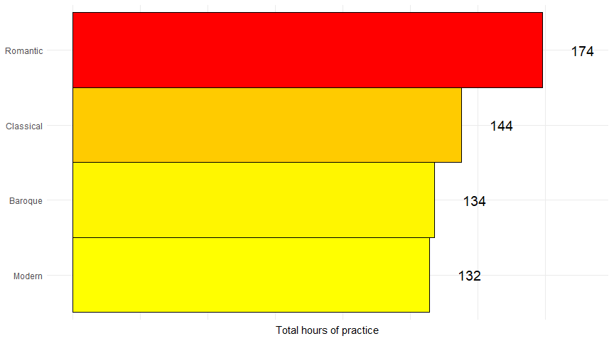
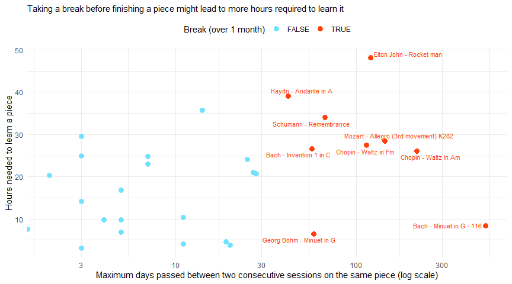
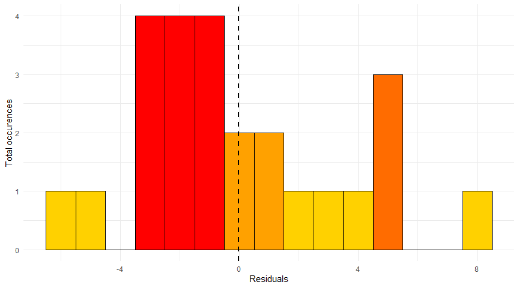

---
    output:
      html_document:
              
        toc: true
        toc_float: false
        toc_depth: 3
        number_sections: true
        
        code_folding: hide
        code_download: true
        
        fig_width: 9 
        fig_height: 5
        fig_align: "center"
        
        highlight: pygments
        theme: cerulean
        
        keep_md: true
        
    title: "Human Learning meets Machine Learning"
    subtitle: "1,200+ hours of piano practice"
    author: "by Peter Hontaru"
---

# Introduction

## Problem statement {-}

### the why {-}

Learning a piano piece is a time-intensive process. Like with most other things, we tend to overestimate our own ability and then become frustrated that we cannot learn and play that Chopin piece like a concert pianist after only 30 minutes of practice. Fortunately, unlike what you might hear on Wall Street, previous performance **is** indicative of future success.

There's also a secondary goal here to hopefully provide a source of inspiration for other people that have always thought to themselves "**one day I'll learn a musical instrument**". Any other skill qualifies here, though. I aim to be doing this by, at the very least, allowing for visibility into my own journey. If this is what you want, why not give it a try?

### the what {-}

**Can we predict how long it would take to learn a piano piece based on a number of factors? If so, which factors influenced the total amount of hours required to learn the piece the most?**

### context {-}

I started playing the piano in 2018 as a complete beginner and I've been tracking my practice time for around 2 and a half years. I've now decided to put that data to good use and see what interesting patterns I might be able to find and hopefully develop a tool that others might be able to use in their journeys.

Here's an example of a recent performance - I mainly play classical music but cannot help but love Elton John's music.

<div align="center">
   <iframe width="560" height="315" src="https://www.youtube.com/embed/3fhhBZyFCzM" frameborder="0" data-external="1" allowfullscreen>
   </iframe>
</div>

## Data collection {-}

- imputed conservative estimations for the first 10 months of the first year (Jan '18 to Oct '18) and on Excel spreadsheet for Nov '18
- everything from Dec '18 onwards was tracked using Toggl, a time-tracking app/tool
- time spent in piano lessons was not tracked/included (usually 2-3 hours total per month)
- the **Extract, Transform, Load** script is available in the **global.R** file of this repo;
- for security reasons, I am not able to share the API script as the token also gives the option to change/remove the profile data; the raw data however, is stored in the **raw data** folder of this repo (not having the API call in simply just means that it won't be up to date for the current year)

**Disclaimer**: I am not affiliated with Toggl. I started using it a few years ago because it provided all the functionality I needed and loved its minimalistic design. The standard membership, which I use, is free of charge.

# Key insights

## Summary:

* identified various trends in my practice habits
* pieces could take me anywhere from ~4 hours to 40+ hours of practice, subject to difficulty (as assessed by the ABRSM grade)
* the **Random Forest** model was shown to be the most optimal model *(bootstrap resampling, 25x)*
    -   **Rsquared** - 0.57
    -   **MAE** - 6.0 hours
    -   **RMSE** - 7.6 hours
* looking at the variability of errors, there is a tendency to over-predict for pieces that took very little time to learn and under-predict for the more difficult ones. There could be two main reasons for this:
  -   artificially inflating the number of hours spent on a piece by returning to it a second time (due to a recital performance, wanting to improve the interpretation further or simply just liking it enough to play it again)
  -   learning easier pieces later on in my journey which means I will learn them faster than expected (based on my earlier data where a piece of a similar difficulty took longer)
-   the most important variables were shown to be the **length of the piece**, **standard of playing**(performance vs casual) and **experience**(lifetime total practice before first practice session on each piece)


# Exploratory Data Analysis (EDA)

## Piano practice timeline


## How long did I practice per piece?

Based on the level at the time and the difficulty of the piece, we can see that each piece took around 10-30 hours of practice.


## How consistent was my practice?

Generally, I've done pretty well to maintain a high level of consistency with the exception of August/December. This is usually where I tend to be away from home on annual leave, and thus, not have access to a piano.


## Was there a trend in my amount of daily average practice? {.tabset .tabset-fade .tabset-pills}

We can see that my practice time was correlated with the consistency, where the average session was much shorter in the months I was away from the piano. There's also a trend where my practice close to an exam session was significantly higher than any other time of the year. **Can you spot in which month I had my exam in 2019? What about the end of 2020?**

*the average practice length per month includes the days in which I did not practice*

### overall {-}


### Year on Year {-}

Similar trends as before are apparent where my average daily session is longer before the exams than during any other time in the year and a dip in the months where I usually take most of my annual leave. I really do need to start picking up the pace and get back to where I used to be.


## Did COVID significantly impact my practice time? {.tabset .tabset-fade .tabset-pills}

### graph {-}

Despite a similar median, we can see that the practice sessions were less likely to be over 80 min after COVID. We can test if this was a significant impact with a t-test.


### skewness assumption {-}

Given the extremely low p-value, the Shapiro-Wilk normality test implies that the distribution of the data is significantly different from a normal distribution and that we cannot assume the normality assumption. However, we're working with the entire population dataset for each class and thus, unlike the independence of data, this assumption is not crucial.
  
<table class=" lightable-paper lightable-hover" style='font-family: "Arial Narrow", arial, helvetica, sans-serif; width: auto !important; margin-left: auto; margin-right: auto;'>
<caption>Shapiro-Wilk normality test</caption>
 <thead>
  <tr>
   <th style="text-align:left;"> group </th>
   <th style="text-align:right;"> statistic </th>
   <th style="text-align:right;"> p.value </th>
   <th style="text-align:left;"> method </th>
  </tr>
 </thead>
<tbody>
  <tr>
   <td style="text-align:left;"> After COVID </td>
   <td style="text-align:right;"> 0.9589908 </td>
   <td style="text-align:right;"> 1e-07 </td>
   <td style="text-align:left;"> Shapiro-Wilk normality test </td>
  </tr>
  <tr>
   <td style="text-align:left;"> Before COVID </td>
   <td style="text-align:right;"> 0.9549818 </td>
   <td style="text-align:right;"> 0e+00 </td>
   <td style="text-align:left;"> Shapiro-Wilk normality test </td>
  </tr>
</tbody>
</table>

### equal variances assumption {-}

We can see that with a large p value, we should fail to reject the null hypothesis (Ho) and conclude that we do not have evidence to believe that population variances are not equal. We can assume that the equal variances assumption was met for our t test

<table class=" lightable-paper lightable-hover" style='font-family: "Arial Narrow", arial, helvetica, sans-serif; width: auto !important; margin-left: auto; margin-right: auto;'>
<caption>Levene's test</caption>
 <thead>
  <tr>
   <th style="text-align:right;"> statistic </th>
   <th style="text-align:right;"> p.value </th>
   <th style="text-align:right;"> df </th>
   <th style="text-align:right;"> df.residual </th>
  </tr>
 </thead>
<tbody>
  <tr>
   <td style="text-align:right;"> 0.0293711 </td>
   <td style="text-align:right;"> 0.8639715 </td>
   <td style="text-align:right;"> 1 </td>
   <td style="text-align:right;"> 746 </td>
  </tr>
</tbody>
</table>

### t-test {-}

My practice sessions post-COVID are significantly shorter than those before the pandemic. This might be surprising, given that we were in the lockdown most of the time. However, I've been spending my time doing a few other things such as improving my technical skillset with R (this analysis wouldn't have been possible otherwise) and learning italian.

<table class=" lightable-paper lightable-hover" style='font-family: "Arial Narrow", arial, helvetica, sans-serif; width: auto !important; margin-left: auto; margin-right: auto;'>
 <thead>
  <tr>
   <th style="text-align:left;"> .y. </th>
   <th style="text-align:left;"> group1 </th>
   <th style="text-align:left;"> group2 </th>
   <th style="text-align:right;"> n1 </th>
   <th style="text-align:right;"> n2 </th>
   <th style="text-align:right;"> statistic </th>
   <th style="text-align:right;"> df </th>
   <th style="text-align:right;"> p </th>
   <th style="text-align:left;"> p.signif </th>
  </tr>
 </thead>
<tbody>
  <tr>
   <td style="text-align:left;"> Duration </td>
   <td style="text-align:left;"> Before COVID </td>
   <td style="text-align:left;"> After COVID </td>
   <td style="text-align:right;"> 433 </td>
   <td style="text-align:right;"> 315 </td>
   <td style="text-align:right;"> 3.892883 </td>
   <td style="text-align:right;"> 746 </td>
   <td style="text-align:right;"> 0.000108 </td>
   <td style="text-align:left;"> *** </td>
  </tr>
</tbody>
</table>

## What type of music do I tend to play? {.tabset .tabset-fade .tabset-pills}

### by genre {-}



### by composer {-}


### by piece {-}


## Relation between difficulty and number of practice hours {.tabset .tabset-fade .tabset-pills}

### ABRSM grade {-}

Simplified, ABRSM grades are a group of 8 exams based on their difficulty (1 - beginner to 8 - advanced). There are also diploma grades but those are extremely advanced, equivalent to university level studies and out of the scope of this analysis. 

More information can be found on their official website at https://gb.abrsm.org/en/exam-support/your-guide-to-abrsm-exams/


### level {-}

A further aggregation of ABRSM grades; this is helpful given the very limited dataset within each grade and much easier on the eye. This is an oversimplification but they're classified as:
  * 1-4: Beginner
  * 5-6: Intermediate
  * 7-8: Advanced


## What about the piece length?


## Learning effect - do pieces of the same difficulty become easier to learn with time?

We can spot a trend where the time required to learn a piece of a similar difficulty (ABRSM Grade) decreases as my ability to play the piano increases (as judged by cumulative hours of practice). We should keep this in mind and include it as a variable into our prediction model.


## Does "pausing" a piece impact the total time required to learn it?

How do we differentiate between pieces that we learn once and those that we come back to repeatedly? Examples could include wanting to improve the playing further, loving it so much we wanted to relearn it, preparing it for a new recital performance, etc.

As anyone that ever played the piano knows, re-learning a piece, particularly after you "drop" it for a few months/years, results in a much better performance/understanding of the piece. I definitely found that to be true in my experience, particularly with my exam pieces.The downside is that these pieces take longer to learn.



## Repertoire

<div style="border: 1px solid #ddd; padding: 0px; overflow-y: scroll; height:450px; "><table class=" lightable-paper lightable-striped lightable-hover" style='font-family: "Arial Narrow", arial, helvetica, sans-serif; width: auto !important; margin-left: auto; margin-right: auto;'>
<caption>Repertoire (red - response variable; green - predictor variables)</caption>
 <thead>
  <tr>
   <th style="text-align:left;position: sticky; top:0; background-color: #FFFFFF;"> Project </th>
   <th style="text-align:right;position: sticky; top:0; background-color: #FFFFFF;"> Duration </th>
   <th style="text-align:left;position: sticky; top:0; background-color: #FFFFFF;"> Genre </th>
   <th style="text-align:right;position: sticky; top:0; background-color: #FFFFFF;"> Length </th>
   <th style="text-align:left;position: sticky; top:0; background-color: #FFFFFF;"> Standard </th>
   <th style="text-align:right;position: sticky; top:0; background-color: #FFFFFF;"> Experience </th>
   <th style="text-align:left;position: sticky; top:0; background-color: #FFFFFF;"> Break </th>
   <th style="text-align:left;position: sticky; top:0; background-color: #FFFFFF;"> ABRSM </th>
   <th style="text-align:left;position: sticky; top:0; background-color: #FFFFFF;"> Level </th>
   <th style="text-align:left;position: sticky; top:0; background-color: #FFFFFF;"> Started </th>
  </tr>
 </thead>
<tbody>
  <tr>
   <td style="text-align:left;font-weight: bold;color: black !important;"> Bach - Marche 127 </td>
   <td style="text-align:right;font-weight: bold;color: red !important;"> 8 </td>
   <td style="text-align:left;font-weight: bold;color: green !important;"> Baroque </td>
   <td style="text-align:right;font-weight: bold;color: green !important;"> 2.2 </td>
   <td style="text-align:left;font-weight: bold;color: green !important;"> Casual </td>
   <td style="text-align:right;font-weight: bold;color: green !important;"> 1200 </td>
   <td style="text-align:left;font-weight: bold;color: green !important;"> No </td>
   <td style="text-align:left;font-weight: bold;color: green !important;"> 4 </td>
   <td style="text-align:left;"> Beginner </td>
   <td style="text-align:left;"> 2021-02-23 </td>
  </tr>
  <tr>
   <td style="text-align:left;font-weight: bold;color: black !important;"> <a href="https://www.youtube.com/watch?v=3fhhBZyFCzM" target="_blank">Elton John - Rocket man</a> </td>
   <td style="text-align:right;font-weight: bold;color: red !important;"> 48 </td>
   <td style="text-align:left;font-weight: bold;color: green !important;"> Modern </td>
   <td style="text-align:right;font-weight: bold;color: green !important;"> 4.0 </td>
   <td style="text-align:left;font-weight: bold;color: green !important;"> Performance </td>
   <td style="text-align:right;font-weight: bold;color: green !important;"> 1130 </td>
   <td style="text-align:left;font-weight: bold;color: green !important;"> Yes </td>
   <td style="text-align:left;font-weight: bold;color: green !important;"> 7 </td>
   <td style="text-align:left;"> Advanced </td>
   <td style="text-align:left;"> 2020-12-08 </td>
  </tr>
  <tr>
   <td style="text-align:left;font-weight: bold;color: black !important;"> <a href="https://www.youtube.com/watch?v=saHo-pDjp2A" target="_blank">Schumann - Träumerei</a> </td>
   <td style="text-align:right;font-weight: bold;color: red !important;"> 14 </td>
   <td style="text-align:left;font-weight: bold;color: green !important;"> Romantic </td>
   <td style="text-align:right;font-weight: bold;color: green !important;"> 3.0 </td>
   <td style="text-align:left;font-weight: bold;color: green !important;"> Casual </td>
   <td style="text-align:right;font-weight: bold;color: green !important;"> 1087 </td>
   <td style="text-align:left;font-weight: bold;color: green !important;"> No </td>
   <td style="text-align:left;font-weight: bold;color: green !important;"> 7 </td>
   <td style="text-align:left;"> Advanced </td>
   <td style="text-align:left;"> 2020-11-09 </td>
  </tr>
  <tr>
   <td style="text-align:left;font-weight: bold;color: black !important;"> Mozart - Allegro (3rd movement) K282 </td>
   <td style="text-align:right;font-weight: bold;color: red !important;"> 28 </td>
   <td style="text-align:left;font-weight: bold;color: green !important;"> Classical </td>
   <td style="text-align:right;font-weight: bold;color: green !important;"> 3.3 </td>
   <td style="text-align:left;font-weight: bold;color: green !important;"> Casual </td>
   <td style="text-align:right;font-weight: bold;color: green !important;"> 1081 </td>
   <td style="text-align:left;font-weight: bold;color: green !important;"> Yes </td>
   <td style="text-align:left;font-weight: bold;color: green !important;"> 6 </td>
   <td style="text-align:left;"> Intermediate </td>
   <td style="text-align:left;"> 2020-11-05 </td>
  </tr>
  <tr>
   <td style="text-align:left;font-weight: bold;color: black !important;"> <a href="https://www.youtube.com/watch?v=4_DyAzPXfvw" target="_blank">Ibert - Sérénade sur l’eau</a> </td>
   <td style="text-align:right;font-weight: bold;color: red !important;"> 10 </td>
   <td style="text-align:left;font-weight: bold;color: green !important;"> Modern </td>
   <td style="text-align:right;font-weight: bold;color: green !important;"> 1.8 </td>
   <td style="text-align:left;font-weight: bold;color: green !important;"> Performance </td>
   <td style="text-align:right;font-weight: bold;color: green !important;"> 1038 </td>
   <td style="text-align:left;font-weight: bold;color: green !important;"> No </td>
   <td style="text-align:left;font-weight: bold;color: green !important;"> 6 </td>
   <td style="text-align:left;"> Intermediate </td>
   <td style="text-align:left;"> 2020-09-24 </td>
  </tr>
  <tr>
   <td style="text-align:left;font-weight: bold;color: black !important;"> <a href="https://www.youtube.com/watch?v=xVkBpSVfV7Y" target="_blank">Kuhlau - Rondo Vivace</a> </td>
   <td style="text-align:right;font-weight: bold;color: red !important;"> 24 </td>
   <td style="text-align:left;font-weight: bold;color: green !important;"> Classical </td>
   <td style="text-align:right;font-weight: bold;color: green !important;"> 2.2 </td>
   <td style="text-align:left;font-weight: bold;color: green !important;"> Casual </td>
   <td style="text-align:right;font-weight: bold;color: green !important;"> 1014 </td>
   <td style="text-align:left;font-weight: bold;color: green !important;"> No </td>
   <td style="text-align:left;font-weight: bold;color: green !important;"> 6 </td>
   <td style="text-align:left;"> Intermediate </td>
   <td style="text-align:left;"> 2020-08-03 </td>
  </tr>
  <tr>
   <td style="text-align:left;font-weight: bold;color: black !important;"> <a href="https://www.youtube.com/watch?v=CNL9Cibhra4" target="_blank">C. Hartmann - The little ballerina</a> </td>
   <td style="text-align:right;font-weight: bold;color: red !important;"> 21 </td>
   <td style="text-align:left;font-weight: bold;color: green !important;"> Romantic </td>
   <td style="text-align:right;font-weight: bold;color: green !important;"> 2.0 </td>
   <td style="text-align:left;font-weight: bold;color: green !important;"> Performance </td>
   <td style="text-align:right;font-weight: bold;color: green !important;"> 998 </td>
   <td style="text-align:left;font-weight: bold;color: green !important;"> No </td>
   <td style="text-align:left;font-weight: bold;color: green !important;"> 6 </td>
   <td style="text-align:left;"> Intermediate </td>
   <td style="text-align:left;"> 2020-07-14 </td>
  </tr>
  <tr>
   <td style="text-align:left;font-weight: bold;color: black !important;"> Schumann - Lalling Melody </td>
   <td style="text-align:right;font-weight: bold;color: red !important;"> 5 </td>
   <td style="text-align:left;font-weight: bold;color: green !important;"> Romantic </td>
   <td style="text-align:right;font-weight: bold;color: green !important;"> 1.5 </td>
   <td style="text-align:left;font-weight: bold;color: green !important;"> Casual </td>
   <td style="text-align:right;font-weight: bold;color: green !important;"> 981 </td>
   <td style="text-align:left;font-weight: bold;color: green !important;"> No </td>
   <td style="text-align:left;font-weight: bold;color: green !important;"> 1 </td>
   <td style="text-align:left;"> Beginner </td>
   <td style="text-align:left;"> 2020-06-28 </td>
  </tr>
  <tr>
   <td style="text-align:left;font-weight: bold;color: black !important;"> <a href="https://www.youtube.com/watch?v=gVrFu3CvvLw" target="_blank">Schumann - Melody</a> </td>
   <td style="text-align:right;font-weight: bold;color: red !important;"> 4 </td>
   <td style="text-align:left;font-weight: bold;color: green !important;"> Romantic </td>
   <td style="text-align:right;font-weight: bold;color: green !important;"> 1.1 </td>
   <td style="text-align:left;font-weight: bold;color: green !important;"> Casual </td>
   <td style="text-align:right;font-weight: bold;color: green !important;"> 972 </td>
   <td style="text-align:left;font-weight: bold;color: green !important;"> No </td>
   <td style="text-align:left;font-weight: bold;color: green !important;"> 1 </td>
   <td style="text-align:left;"> Beginner </td>
   <td style="text-align:left;"> 2020-06-20 </td>
  </tr>
  <tr>
   <td style="text-align:left;font-weight: bold;color: black !important;"> <a href="https://www.youtube.com/watch?v=kz_xYj9YmMI" target="_blank">Clementi - Sonatina no 3 - Mov 2</a> </td>
   <td style="text-align:right;font-weight: bold;color: red !important;"> 3 </td>
   <td style="text-align:left;font-weight: bold;color: green !important;"> Classical </td>
   <td style="text-align:right;font-weight: bold;color: green !important;"> 1.0 </td>
   <td style="text-align:left;font-weight: bold;color: green !important;"> Performance </td>
   <td style="text-align:right;font-weight: bold;color: green !important;"> 952 </td>
   <td style="text-align:left;font-weight: bold;color: green !important;"> No </td>
   <td style="text-align:left;font-weight: bold;color: green !important;"> 1 </td>
   <td style="text-align:left;"> Beginner </td>
   <td style="text-align:left;"> 2020-06-04 </td>
  </tr>
  <tr>
   <td style="text-align:left;font-weight: bold;color: black !important;"> <a href="https://www.youtube.com/watch?v=e9F4OFqknSs" target="_blank">Clementi - Sonatina no 3 - Mov 3</a> </td>
   <td style="text-align:right;font-weight: bold;color: red !important;"> 20 </td>
   <td style="text-align:left;font-weight: bold;color: green !important;"> Classical </td>
   <td style="text-align:right;font-weight: bold;color: green !important;"> 2.1 </td>
   <td style="text-align:left;font-weight: bold;color: green !important;"> Performance </td>
   <td style="text-align:right;font-weight: bold;color: green !important;"> 952 </td>
   <td style="text-align:left;font-weight: bold;color: green !important;"> No </td>
   <td style="text-align:left;font-weight: bold;color: green !important;"> 4 </td>
   <td style="text-align:left;"> Beginner </td>
   <td style="text-align:left;"> 2020-06-04 </td>
  </tr>
  <tr>
   <td style="text-align:left;font-weight: bold;color: black !important;"> <a href="https://www.youtube.com/watch?v=BT5BlqMKNTU" target="_blank">Chopin - Waltz in Fm</a> </td>
   <td style="text-align:right;font-weight: bold;color: red !important;"> 27 </td>
   <td style="text-align:left;font-weight: bold;color: green !important;"> Romantic </td>
   <td style="text-align:right;font-weight: bold;color: green !important;"> 2.0 </td>
   <td style="text-align:left;font-weight: bold;color: green !important;"> Performance </td>
   <td style="text-align:right;font-weight: bold;color: green !important;"> 895 </td>
   <td style="text-align:left;font-weight: bold;color: green !important;"> Yes </td>
   <td style="text-align:left;font-weight: bold;color: green !important;"> 6 </td>
   <td style="text-align:left;"> Intermediate </td>
   <td style="text-align:left;"> 2020-04-18 </td>
  </tr>
  <tr>
   <td style="text-align:left;font-weight: bold;color: black !important;"> <a href="https://www.youtube.com/watch?v=sHFxSDUR5P4" target="_blank">Clementi - Sonatina no 3 - Mov 1</a> </td>
   <td style="text-align:right;font-weight: bold;color: red !important;"> 30 </td>
   <td style="text-align:left;font-weight: bold;color: green !important;"> Classical </td>
   <td style="text-align:right;font-weight: bold;color: green !important;"> 2.5 </td>
   <td style="text-align:left;font-weight: bold;color: green !important;"> Performance </td>
   <td style="text-align:right;font-weight: bold;color: green !important;"> 877 </td>
   <td style="text-align:left;font-weight: bold;color: green !important;"> No </td>
   <td style="text-align:left;font-weight: bold;color: green !important;"> 4 </td>
   <td style="text-align:left;"> Beginner </td>
   <td style="text-align:left;"> 2020-04-07 </td>
  </tr>
  <tr>
   <td style="text-align:left;font-weight: bold;color: black !important;"> <a href="https://www.youtube.com/watch?v=wID0YkzaeQc" target="_blank">Schumann - Kinderszenen 1</a> </td>
   <td style="text-align:right;font-weight: bold;color: red !important;"> 10 </td>
   <td style="text-align:left;font-weight: bold;color: green !important;"> Romantic </td>
   <td style="text-align:right;font-weight: bold;color: green !important;"> 2.0 </td>
   <td style="text-align:left;font-weight: bold;color: green !important;"> Casual </td>
   <td style="text-align:right;font-weight: bold;color: green !important;"> 855 </td>
   <td style="text-align:left;font-weight: bold;color: green !important;"> No </td>
   <td style="text-align:left;font-weight: bold;color: green !important;"> 5 </td>
   <td style="text-align:left;"> Intermediate </td>
   <td style="text-align:left;"> 2020-03-25 </td>
  </tr>
  <tr>
   <td style="text-align:left;font-weight: bold;color: black !important;"> <a href="https://www.youtube.com/watch?v=mPf9pXWkH04" target="_blank">Bach - Prelude in G from Cello Suite No 1</a> </td>
   <td style="text-align:right;font-weight: bold;color: red !important;"> 25 </td>
   <td style="text-align:left;font-weight: bold;color: green !important;"> Baroque </td>
   <td style="text-align:right;font-weight: bold;color: green !important;"> 2.5 </td>
   <td style="text-align:left;font-weight: bold;color: green !important;"> Performance </td>
   <td style="text-align:right;font-weight: bold;color: green !important;"> 788 </td>
   <td style="text-align:left;font-weight: bold;color: green !important;"> No </td>
   <td style="text-align:left;font-weight: bold;color: green !important;"> 5 </td>
   <td style="text-align:left;"> Intermediate </td>
   <td style="text-align:left;"> 2020-02-04 </td>
  </tr>
  <tr>
   <td style="text-align:left;font-weight: bold;color: black !important;"> <a href="https://www.youtube.com/watch?v=fM0qSYId7FM" target="_blank">Georg Böhm - Minuet in G</a> </td>
   <td style="text-align:right;font-weight: bold;color: red !important;"> 7 </td>
   <td style="text-align:left;font-weight: bold;color: green !important;"> Baroque </td>
   <td style="text-align:right;font-weight: bold;color: green !important;"> 0.8 </td>
   <td style="text-align:left;font-weight: bold;color: green !important;"> Casual </td>
   <td style="text-align:right;font-weight: bold;color: green !important;"> 780 </td>
   <td style="text-align:left;font-weight: bold;color: green !important;"> Yes </td>
   <td style="text-align:left;font-weight: bold;color: green !important;"> 2 </td>
   <td style="text-align:left;"> Beginner </td>
   <td style="text-align:left;"> 2020-01-27 </td>
  </tr>
  <tr>
   <td style="text-align:left;font-weight: bold;color: black !important;"> <a href="https://www.youtube.com/watch?v=OMA9KnxuoSg" target="_blank">Bach - Invention 4 in Dm</a> </td>
   <td style="text-align:right;font-weight: bold;color: red !important;"> 21 </td>
   <td style="text-align:left;font-weight: bold;color: green !important;"> Baroque </td>
   <td style="text-align:right;font-weight: bold;color: green !important;"> 1.5 </td>
   <td style="text-align:left;font-weight: bold;color: green !important;"> Performance </td>
   <td style="text-align:right;font-weight: bold;color: green !important;"> 777 </td>
   <td style="text-align:left;font-weight: bold;color: green !important;"> No </td>
   <td style="text-align:left;font-weight: bold;color: green !important;"> 5 </td>
   <td style="text-align:left;"> Intermediate </td>
   <td style="text-align:left;"> 2020-01-25 </td>
  </tr>
  <tr>
   <td style="text-align:left;font-weight: bold;color: black !important;"> <a href="https://www.youtube.com/watch?v=IyxUJuKn48s" target="_blank">Chopin - Contredanse in Gb</a> </td>
   <td style="text-align:right;font-weight: bold;color: red !important;"> 23 </td>
   <td style="text-align:left;font-weight: bold;color: green !important;"> Romantic </td>
   <td style="text-align:right;font-weight: bold;color: green !important;"> 2.2 </td>
   <td style="text-align:left;font-weight: bold;color: green !important;"> Performance </td>
   <td style="text-align:right;font-weight: bold;color: green !important;"> 762 </td>
   <td style="text-align:left;font-weight: bold;color: green !important;"> No </td>
   <td style="text-align:left;font-weight: bold;color: green !important;"> 6 </td>
   <td style="text-align:left;"> Intermediate </td>
   <td style="text-align:left;"> 2020-01-16 </td>
  </tr>
  <tr>
   <td style="text-align:left;font-weight: bold;color: black !important;"> <a href="https://www.youtube.com/watch?v=9fNanix5B24" target="_blank">Bach - Minuet in Gm - 115</a> </td>
   <td style="text-align:right;font-weight: bold;color: red !important;"> 7 </td>
   <td style="text-align:left;font-weight: bold;color: green !important;"> Baroque </td>
   <td style="text-align:right;font-weight: bold;color: green !important;"> 1.3 </td>
   <td style="text-align:left;font-weight: bold;color: green !important;"> Casual </td>
   <td style="text-align:right;font-weight: bold;color: green !important;"> 750 </td>
   <td style="text-align:left;font-weight: bold;color: green !important;"> No </td>
   <td style="text-align:left;font-weight: bold;color: green !important;"> 2 </td>
   <td style="text-align:left;"> Beginner </td>
   <td style="text-align:left;"> 2020-01-07 </td>
  </tr>
  <tr>
   <td style="text-align:left;font-weight: bold;color: black !important;"> <a href="https://www.youtube.com/watch?v=yO-sx_IoUzQ" target="_blank">Bach - Minuet in G - 114</a> </td>
   <td style="text-align:right;font-weight: bold;color: red !important;"> 4 </td>
   <td style="text-align:left;font-weight: bold;color: green !important;"> Baroque </td>
   <td style="text-align:right;font-weight: bold;color: green !important;"> 1.5 </td>
   <td style="text-align:left;font-weight: bold;color: green !important;"> Casual </td>
   <td style="text-align:right;font-weight: bold;color: green !important;"> 726 </td>
   <td style="text-align:left;font-weight: bold;color: green !important;"> No </td>
   <td style="text-align:left;font-weight: bold;color: green !important;"> 1 </td>
   <td style="text-align:left;"> Beginner </td>
   <td style="text-align:left;"> 2019-12-06 </td>
  </tr>
  <tr>
   <td style="text-align:left;font-weight: bold;color: black !important;"> <a href="https://www.youtube.com/watch?v=qhf3vcjb6dE" target="_blank">Elton John - Your song (Arr Cornick)</a> </td>
   <td style="text-align:right;font-weight: bold;color: red !important;"> 36 </td>
   <td style="text-align:left;font-weight: bold;color: green !important;"> Modern </td>
   <td style="text-align:right;font-weight: bold;color: green !important;"> 3.2 </td>
   <td style="text-align:left;font-weight: bold;color: green !important;"> Performance </td>
   <td style="text-align:right;font-weight: bold;color: green !important;"> 713 </td>
   <td style="text-align:left;font-weight: bold;color: green !important;"> No </td>
   <td style="text-align:left;font-weight: bold;color: green !important;"> 5 </td>
   <td style="text-align:left;"> Intermediate </td>
   <td style="text-align:left;"> 2019-11-21 </td>
  </tr>
  <tr>
   <td style="text-align:left;font-weight: bold;color: black !important;"> <a href="https://www.youtube.com/watch?v=M1AXbX0DPl0" target="_blank">Poulenc - Valse Tyrolienne</a> </td>
   <td style="text-align:right;font-weight: bold;color: red !important;"> 17 </td>
   <td style="text-align:left;font-weight: bold;color: green !important;"> Modern </td>
   <td style="text-align:right;font-weight: bold;color: green !important;"> 1.5 </td>
   <td style="text-align:left;font-weight: bold;color: green !important;"> Performance </td>
   <td style="text-align:right;font-weight: bold;color: green !important;"> 562 </td>
   <td style="text-align:left;font-weight: bold;color: green !important;"> No </td>
   <td style="text-align:left;font-weight: bold;color: green !important;"> 5 </td>
   <td style="text-align:left;"> Intermediate </td>
   <td style="text-align:left;"> 2019-09-02 </td>
  </tr>
  <tr>
   <td style="text-align:left;font-weight: bold;color: black !important;"> <a href="https://www.youtube.com/watch?v=gYPky_fJ-kY" target="_blank">Bach - Prelude in Cm - 934</a> </td>
   <td style="text-align:right;font-weight: bold;color: red !important;"> 25 </td>
   <td style="text-align:left;font-weight: bold;color: green !important;"> Baroque </td>
   <td style="text-align:right;font-weight: bold;color: green !important;"> 2.6 </td>
   <td style="text-align:left;font-weight: bold;color: green !important;"> Performance </td>
   <td style="text-align:right;font-weight: bold;color: green !important;"> 536 </td>
   <td style="text-align:left;font-weight: bold;color: green !important;"> No </td>
   <td style="text-align:left;font-weight: bold;color: green !important;"> 5 </td>
   <td style="text-align:left;"> Intermediate </td>
   <td style="text-align:left;"> 2019-08-15 </td>
  </tr>
  <tr>
   <td style="text-align:left;font-weight: bold;color: black !important;"> <a href="https://www.youtube.com/watch?v=SwBf-f7A8rM" target="_blank">Schumann - Volksliedchen</a> </td>
   <td style="text-align:right;font-weight: bold;color: red !important;"> 10 </td>
   <td style="text-align:left;font-weight: bold;color: green !important;"> Romantic </td>
   <td style="text-align:right;font-weight: bold;color: green !important;"> 2.0 </td>
   <td style="text-align:left;font-weight: bold;color: green !important;"> Casual </td>
   <td style="text-align:right;font-weight: bold;color: green !important;"> 501 </td>
   <td style="text-align:left;font-weight: bold;color: green !important;"> No </td>
   <td style="text-align:left;font-weight: bold;color: green !important;"> 3 </td>
   <td style="text-align:left;"> Beginner </td>
   <td style="text-align:left;"> 2019-07-01 </td>
  </tr>
  <tr>
   <td style="text-align:left;font-weight: bold;color: black !important;"> <a href="https://www.youtube.com/watch?v=PNeUXz5UQMo" target="_blank">Haydn - Andante in A</a> </td>
   <td style="text-align:right;font-weight: bold;color: red !important;"> 39 </td>
   <td style="text-align:left;font-weight: bold;color: green !important;"> Classical </td>
   <td style="text-align:right;font-weight: bold;color: green !important;"> 2.8 </td>
   <td style="text-align:left;font-weight: bold;color: green !important;"> Casual </td>
   <td style="text-align:right;font-weight: bold;color: green !important;"> 468 </td>
   <td style="text-align:left;font-weight: bold;color: green !important;"> Yes </td>
   <td style="text-align:left;font-weight: bold;color: green !important;"> 5 </td>
   <td style="text-align:left;"> Intermediate </td>
   <td style="text-align:left;"> 2019-06-08 </td>
  </tr>
  <tr>
   <td style="text-align:left;font-weight: bold;color: black !important;"> <a href="https://www.youtube.com/watch?v=Iv7L0cMpIqg" target="_blank">Schumann - Remembrance</a> </td>
   <td style="text-align:right;font-weight: bold;color: red !important;"> 34 </td>
   <td style="text-align:left;font-weight: bold;color: green !important;"> Romantic </td>
   <td style="text-align:right;font-weight: bold;color: green !important;"> 2.2 </td>
   <td style="text-align:left;font-weight: bold;color: green !important;"> Performance </td>
   <td style="text-align:right;font-weight: bold;color: green !important;"> 422 </td>
   <td style="text-align:left;font-weight: bold;color: green !important;"> Yes </td>
   <td style="text-align:left;font-weight: bold;color: green !important;"> 5 </td>
   <td style="text-align:left;"> Intermediate </td>
   <td style="text-align:left;"> 2019-04-28 </td>
  </tr>
  <tr>
   <td style="text-align:left;font-weight: bold;color: black !important;"> Bach - Minuet in G - 116 </td>
   <td style="text-align:right;font-weight: bold;color: red !important;"> 8 </td>
   <td style="text-align:left;font-weight: bold;color: green !important;"> Baroque </td>
   <td style="text-align:right;font-weight: bold;color: green !important;"> 1.8 </td>
   <td style="text-align:left;font-weight: bold;color: green !important;"> Casual </td>
   <td style="text-align:right;font-weight: bold;color: green !important;"> 361 </td>
   <td style="text-align:left;font-weight: bold;color: green !important;"> Yes </td>
   <td style="text-align:left;font-weight: bold;color: green !important;"> 3 </td>
   <td style="text-align:left;"> Beginner </td>
   <td style="text-align:left;"> 2019-03-04 </td>
  </tr>
  <tr>
   <td style="text-align:left;font-weight: bold;color: black !important;"> <a href="https://www.youtube.com/watch?v=Lh-3bkEZCwc" target="_blank">Bach - Invention 1 in C</a> </td>
   <td style="text-align:right;font-weight: bold;color: red !important;"> 27 </td>
   <td style="text-align:left;font-weight: bold;color: green !important;"> Baroque </td>
   <td style="text-align:right;font-weight: bold;color: green !important;"> 1.5 </td>
   <td style="text-align:left;font-weight: bold;color: green !important;"> Performance </td>
   <td style="text-align:right;font-weight: bold;color: green !important;"> 350 </td>
   <td style="text-align:left;font-weight: bold;color: green !important;"> Yes </td>
   <td style="text-align:left;font-weight: bold;color: green !important;"> 5 </td>
   <td style="text-align:left;"> Intermediate </td>
   <td style="text-align:left;"> 2019-02-22 </td>
  </tr>
  <tr>
   <td style="text-align:left;font-weight: bold;color: black !important;"> <a href="https://www.youtube.com/watch?v=92_jiShhN5w" target="_blank">Chopin - Waltz in Am</a> </td>
   <td style="text-align:right;font-weight: bold;color: red !important;"> 26 </td>
   <td style="text-align:left;font-weight: bold;color: green !important;"> Romantic </td>
   <td style="text-align:right;font-weight: bold;color: green !important;"> 2.6 </td>
   <td style="text-align:left;font-weight: bold;color: green !important;"> Performance </td>
   <td style="text-align:right;font-weight: bold;color: green !important;"> 305 </td>
   <td style="text-align:left;font-weight: bold;color: green !important;"> Yes </td>
   <td style="text-align:left;font-weight: bold;color: green !important;"> 5 </td>
   <td style="text-align:left;"> Intermediate </td>
   <td style="text-align:left;"> 2019-01-07 </td>
  </tr>
</tbody>
</table></div>

# Modelling

Question: **Can we predict how long it would take to learn a piano piece based on a number of factors? If so, which factors influenced the total amount of hours required to learn the piece the most?**

## outliers

We can see that there are some outliers in our dataset:

* no. 16 and no. 28 are two Advanced (Grade 7 pieces). These are the only two pieces within this category and will be removed as they are both outliers; they will be introduced as I learn more Advanced repertoire (it is also likely that no. 16 is significantly harder than grade 7, but it is a custom arrangement and cannot be assigned a specific grade)
* no. 14 is an extremely short movement of a piece (a few seconds long) that unites the first and third movement of the same piece and it took very little time to learn
* no 4 is a piece that I previously learnt but did not track the time spent on a piece (as I wasn't tracking individual times back then). It then took significantly less time to re-learn it


## missing values

There are no missing values in the modelling dataset following the ETL process.

## feature engineering

* **categorical**:
  * **ABRSM grade**: 1 to 8
  * **Genre**: Baroque, Classical, Romantic, Modern
  * **Break**: learning it continuously or setting it aside for a while (1 month minimum)
  * **Standard** of practice: public performance or casual (relative to someone's level of playing)
* **numerical**:
  * **Experience**: total hours practiced before the first practice session on each piece
  * **Length** of the piece: minutes

## near zero variance

We can see that the *Break* feature has low variance (a high ratio of the most common answer "No" to the second most common "Yes"). We can exclude this from the model.


```
## [1] "Break"
```

## pre-processing

Let's use some basic standardisation offered by the caret package such as **centering** (subtract mean from values) and **scaling** (divide values by standard deviation).


## resampling

Given the small size of the dataset, bootstrapping resampling method will be applied. This will give multiple estimates of out-of-sample error, rather than a single estimate.


## model selection


We chose the Random Forest model as it was the best performing model. It is known as a model which is:

* not very sensitive to outliers
* good for non-linearity
* however, variable importance can be biased if categorical variables have few levels (toward high levels) or are correlated

The model selected had the mtry parameter (number of randomly selected variables used at each split) equal to 6.


```
## 
## Call:
## summary.resamples(object = model_comparison)
## 
## Models: ranger, lmStepAIC, lm, ridge, rf, gbm, pls 
## Number of resamples: 25 
## 
## MAE 
##               Min.  1st Qu.   Median     Mean  3rd Qu.      Max. NA's
## ranger    2.419997 4.080959 5.196473 5.123377 6.077655  8.195117    0
## lmStepAIC 3.968242 6.687709 7.781494 8.072575 8.813780 20.205612    0
## lm        4.418096 6.524852 7.964707 8.557616 9.539582 18.349102    0
## ridge     3.307420 4.515884 5.699746 5.569833 6.399087  8.408524    6
## rf        3.205740 5.118807 5.932867 6.038378 6.666790  9.904368    0
## gbm       4.089667 6.355343 7.168571 7.662897 9.228424 12.431810    0
## pls       3.483062 3.983705 4.621237 4.774614 5.353614  6.982680    0
## 
## RMSE 
##               Min.  1st Qu.    Median      Mean   3rd Qu.      Max. NA's
## ranger    3.068576 5.072204  6.300954  6.309951  7.265692  9.490835    0
## lmStepAIC 4.733275 7.863627 10.469526 10.245300 10.969664 24.911850    0
## lm        4.814727 7.559685 10.062189 10.764801 12.000870 23.377924    0
## ridge     4.085891 5.456852  6.509323  6.710812  7.824420 10.594639    6
## rf        4.064252 6.520044  7.170733  7.281298  8.102163 12.275178    0
## gbm       4.748131 7.952227  8.436318  9.455613 12.101037 16.468413    0
## pls       4.118035 5.008394  5.609687  5.704572  6.350988  7.854617    0
## 
## Rsquared 
##                   Min.   1st Qu.    Median      Mean   3rd Qu.      Max. NA's
## ranger    0.0281671341 0.5739776 0.6517399 0.6225855 0.7995505 0.9432270    0
## lmStepAIC 0.1525972285 0.3153611 0.4496154 0.4768795 0.6350944 0.9211133    0
## lm        0.0131385156 0.1889992 0.4552897 0.4218550 0.6417713 0.8298442    0
## ridge     0.2034848134 0.5639332 0.6313464 0.6250199 0.7636798 0.8591136    6
## rf        0.0635134558 0.4669159 0.5633518 0.5693602 0.7458371 0.8831978    0
## gbm       0.0003225047 0.1205368 0.4806110 0.4128403 0.6792372 0.8289043    0
## pls       0.2550967916 0.6282707 0.7328504 0.7041134 0.8232193 0.9018937    0
```

## model evaluation

Based on our regression model, it does not look like we have significant multicollinearity between the full model variables so we can continue with our full model of 6 variables.

<table class=" lightable-paper lightable-hover" style='font-family: "Arial Narrow", arial, helvetica, sans-serif; width: auto !important; margin-left: auto; margin-right: auto;'>
<caption>Variance Inflation Factor (VIF)</caption>
 <thead>
  <tr>
   <th style="text-align:left;"> names </th>
   <th style="text-align:right;"> VIF </th>
  </tr>
 </thead>
<tbody>
  <tr>
   <td style="text-align:left;"> ABRSM5 </td>
   <td style="text-align:right;"> 9.6 </td>
  </tr>
  <tr>
   <td style="text-align:left;"> ABRSM6 </td>
   <td style="text-align:right;"> 5.7 </td>
  </tr>
  <tr>
   <td style="text-align:left;"> Cumulative_Duration </td>
   <td style="text-align:right;"> 5.2 </td>
  </tr>
  <tr>
   <td style="text-align:left;"> ABRSM4 </td>
   <td style="text-align:right;"> 4.8 </td>
  </tr>
  <tr>
   <td style="text-align:left;"> ABRSM3 </td>
   <td style="text-align:right;"> 4.5 </td>
  </tr>
  <tr>
   <td style="text-align:left;"> StandardPerformance </td>
   <td style="text-align:right;"> 3.3 </td>
  </tr>
  <tr>
   <td style="text-align:left;"> ABRSM2 </td>
   <td style="text-align:right;"> 3.1 </td>
  </tr>
  <tr>
   <td style="text-align:left;"> GenreClassical </td>
   <td style="text-align:right;"> 3.0 </td>
  </tr>
  <tr>
   <td style="text-align:left;"> GenreRomantic </td>
   <td style="text-align:right;"> 2.3 </td>
  </tr>
  <tr>
   <td style="text-align:left;"> Length </td>
   <td style="text-align:right;"> 2.2 </td>
  </tr>
  <tr>
   <td style="text-align:left;"> GenreModern </td>
   <td style="text-align:right;"> 1.6 </td>
  </tr>
</tbody>
</table>

### actuals vs predictions


### residual distribution {.tabset .tabset-fade .tabset-pills}

#### histogram {-}

We can see that the residuals are mostly situated around 0.



#### QQ plot / normal probability plot of residuals {-}

Similar to the previous histogram, we can spot some deviations from the normal distribution. Overall, we can state that the residuals follow a normal distribution.


### independence of residuals (and hence observations)

There seems to be a slight trend where newer pieces have a smaller residuals. This could mean a lack of independence from the order of data collection (the model predictions are based on my current level of playing).


### actuals versus residuals

Looking at the variability of errors, there is still a tendency to over-predict for pieces that took very little time to learn and under-predict for the more difficult ones. There could be two main reasons for this:

  -   artificially inflating the number of hours spent on a piece by returning to it a second time (due to a recital performance, wanting to improve the interpretation further or simply just liking it enough to play it again)
  -   learning easier pieces later on in my journey which means I will learn them faster than expected (based on my earlier data where a piece of a similar difficulty took longer)


## Linear Regression (LR) or Random Forest (RF)?

We can see that the Random Forest performed significantly better than the simpler Linear Regression model. This isn't surprising since there might be non-linear trends within the data, and RFs are known to be more accurate (at the cost of interpretability and computing power).

<table class=" lightable-paper lightable-hover" style='font-family: "Arial Narrow", arial, helvetica, sans-serif; width: auto !important; margin-left: auto; margin-right: auto;'>
<caption>Random Forest vs Linear Regression</caption>
 <thead>
  <tr>
   <th style="text-align:right;"> estimate </th>
   <th style="text-align:right;"> statistic </th>
   <th style="text-align:right;"> p.value </th>
   <th style="text-align:right;"> parameter </th>
   <th style="text-align:right;"> conf.low </th>
   <th style="text-align:right;"> conf.high </th>
   <th style="text-align:left;"> method </th>
   <th style="text-align:left;"> alternative </th>
  </tr>
 </thead>
<tbody>
  <tr>
   <td style="text-align:right;"> 3.483503 </td>
   <td style="text-align:right;"> 3.988638 </td>
   <td style="text-align:right;"> 0.0005423 </td>
   <td style="text-align:right;"> 24 </td>
   <td style="text-align:right;"> 1.680984 </td>
   <td style="text-align:right;"> 5.286022 </td>
   <td style="text-align:left;"> One Sample t-test </td>
   <td style="text-align:left;"> two.sided </td>
  </tr>
</tbody>
</table>

## How many predictors did the most optimal model have?


## What were the most important variables?

The most important variables were shown to be the **length of the piece**, **standard of playing**(performance vs casual) and **experience**(lifetime total practice before first practice session on each piece)


# Limitations

-   very **limited data** which did not allow for a train/test split; however, a bootstrap resampling method is known to be a good substitute
-   biased to **one person's** learning ability (others might learn faster or slower)
-   on top of total hours of practice, **quality of practice** is a significant factor which is not captured in this dataset
-   very **difficult to assess when a piece is "finished"** as you can always further improve on your interpretation
-   not all pieces had official **ABRSM ratings** and a few had to be estimated; even for those that do have an official rating, the difficulty of a piece is highly subjective to each pianist and hard to quantify with one number
-   **memorisation** might be a confounding variable that was not accounted for and it could lead to inflating the numbers required on a specific piece

# What's next?

-   keep practicing, gather more data and refresh this analysis + adjust the model
-   add a recommender tab to the shiny dashboard to recommend pieces based on specific features

# Hardest things about this analysis:

* the Extract-Transform-Load process - cleaning the "dirty data" and finding creative ways to input the data on the front-end of the app in order to make it reporting-friendly on the back-end
  * especially true for metadata such as Genre, Type of practice, Composer and Piece name, tag pieces as "work in progress", etc
* automate ways to differentiate between pieces that I came back to vs pieces I only studied once (such whether the maximum difference between two consecutive practice sessions exceeded a threshold)
* work with very limited data

# Interactive application

-   you can find an interactive display of this presentation, as well as the model in production at the [following link](https://peterhontaru.shinyapps.io/Piano-Journal/)
-   <https://peterhontaru.shinyapps.io/Piano-Journal/>


