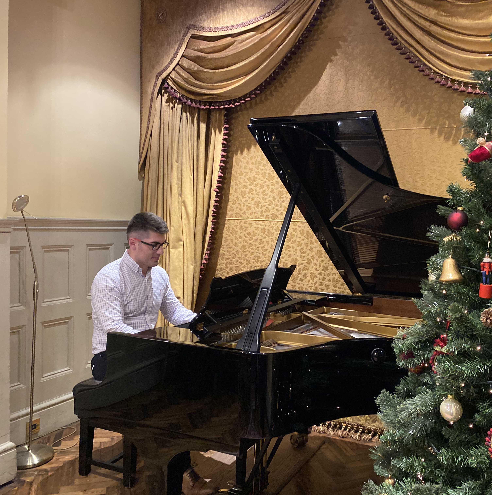
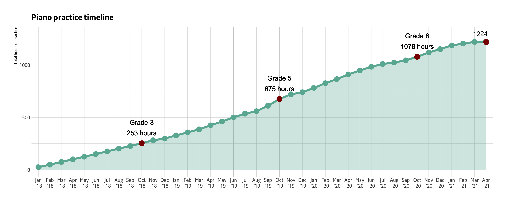
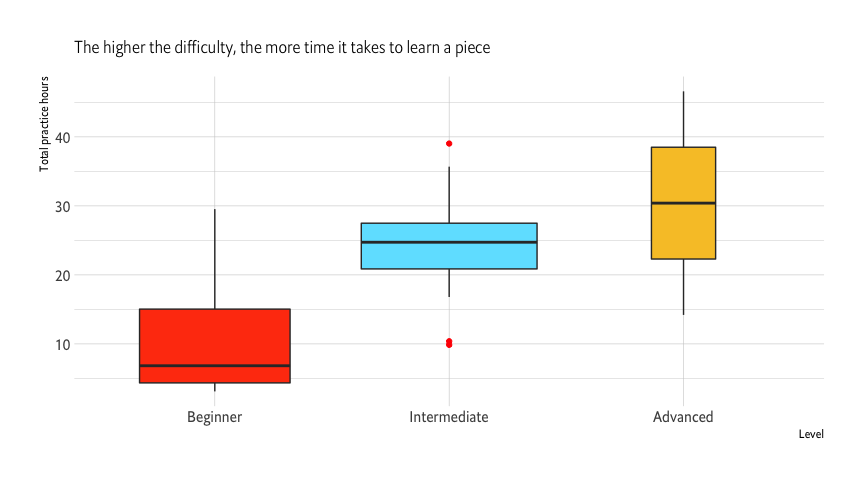
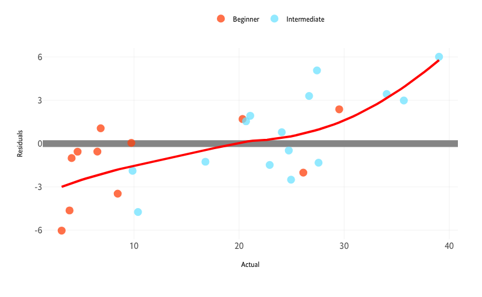
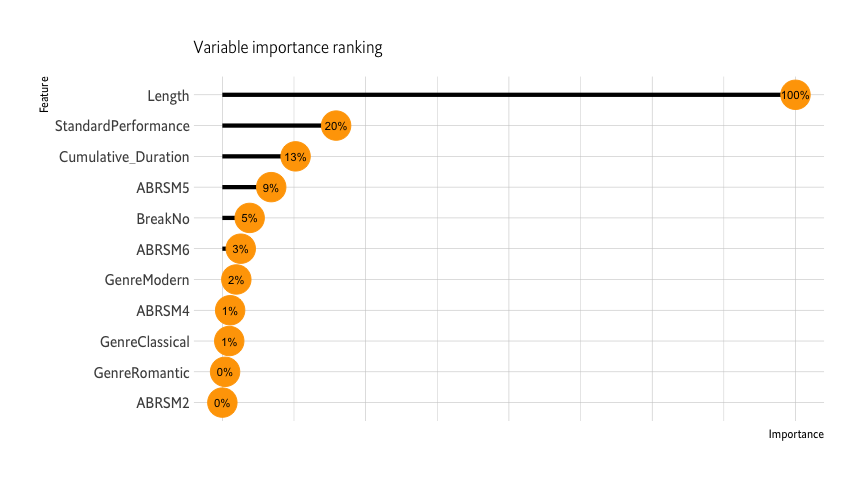

Human Learning meets Machine Learning - 1,200+ hours of piano practice
================
by Peter Hontaru

# Introduction

## Problem statement

**Can we predict how long it would take to learn a piano piece based on
a number of variables? If so, which variables influenced the price the
most?**

## What am I hoping to achieve with this project?

-   predict how long it will take to learn a piece based on various
    features
-   discover insights into my practice habits and find areas where I
    need to improve
-   develop a recommender tool of piano pieces for others to select from
    based on factors of interest
-   hopefully act as a source of inspiration/realistic piano progress
    for others who want to learn a musical instrument

**Context**: I started playing the piano in 2018 as a complete beginner
and I’ve been tracking my practice time for around 2 and a half years. I
now decided to put that to good use and see what interesting patterns I
might be able to find.

## Data collection

-   imputed conservative estimations for the first 10 months of the
    first year (Jan ’18 to Oct ’18)
-   everything from Dec ’18 onwards was tracked using Toggl, a
    time-tracking app/tool
-   these times include my practice sessions (usually in short bouts of
    30 minutes); piano lessons are excluded (usually 2-3 hours total per
    month)
-   the **Extract, Transform, Load** script is available in the global.R
    file of this repo

**Disclaimer**: I am not affiliated with Toggl. I started using it a few
years ago because it provided all the functionality I needed and loved
its minimalistic design. The standard membership, which I use, is free
of charge.

# Key insights

## Summary:

-   identified various trends based on my practice

-   pieces could take me anywhere from around 4 hours to 40+ hours,
    subject to difficulty (as assessed by the ABRSM grade)

-   the **Random Forrest** model was shown to be the most optimal model

    -   **Rsquared** (0.585)
    -   **MAE** - 5.9 hours
    -   **RMSE** - 7.5 hours

Looking at the variability of errors, there is still a tendency to
over-predict for pieces that took very little and under-predict for the
more difficult ones. There could be two main reasons for this:

-   practicing an old piece in order to further improve (which naturally
    adds more practice time as I re-learn it)
-   learning easier pieces later on in my journey which means I will
    learn them faster than expected (based on my earlier data where a
    piece of a similar difficulty took longer)

-   the most important variables were shown to be the number of **length
    of the piece**, **standard of playing** (performance vs casual) and
    **experience**(cumulative hours before first practice session on
    each piece)

# Limitations

-   very **limited data** which did not allow for a train/test split;
    however, a bootstrap resampling method is known to be a good
    substitute
-   biased to **one person’s** learning ability (others might learn
    faster or slower)
-   on top of total hours of practice, **quality of practice** is a
    significant factor which is not captured in this dataset
-   very **difficult to assess when a piece is “finished”** as you can
    always further improve on your interpretation
-   not all pieces had official **ABRSM ratings** and a few had to be
    estimated; even for those that do have an official rating, the
    difficulty of a piece is highly subjective to each pianist and hard
    to quantify with one number
-   **memorisation** might be a confounding variable that was not
    accounted for; sometimes there’s an effort to practice a bit for
    longer just to memorise without an improvement in performance

## What’s next?

-   keep practicing, gather more data and refresh this analysis + update
    the model
-   add a recommender tab to the shiny dashboard where people could be
    recommended a piece based on specific features
-   connect to the Toggl API for live updates

# Extended analysis

Full project available:

-   at the following
    [link](http://htmlpreview.github.io/?https://github.com/peterhontaru/Price-Prediction-Airbnb-Milan-Apartments/blob/master/AirBnb-Milan.html),
    in HTML format
-   in the **AirBnb-Milan.md** file of this repo (however, I recommend
    previewing it at the link above since it was originally designed as
    a html document)

# Interactive application:

-   you can find an interactive display of this presentation, as well as
    the model in production at the [following
    link](https://peterhontaru.shinyapps.io/piano-practice-prediction/)
-   <https://peterhontaru.shinyapps.io/piano-practice-prediction/>
